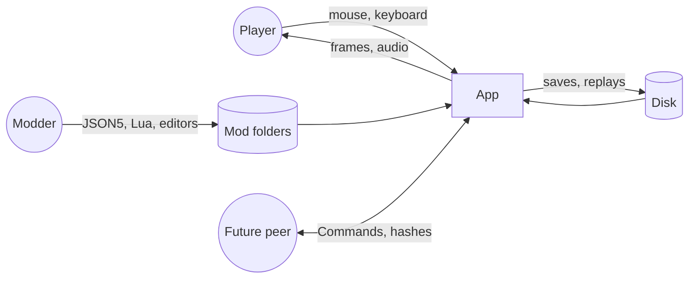
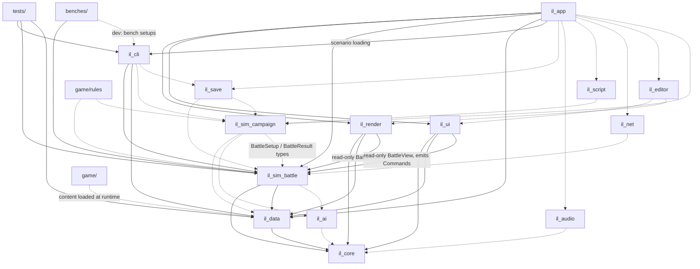
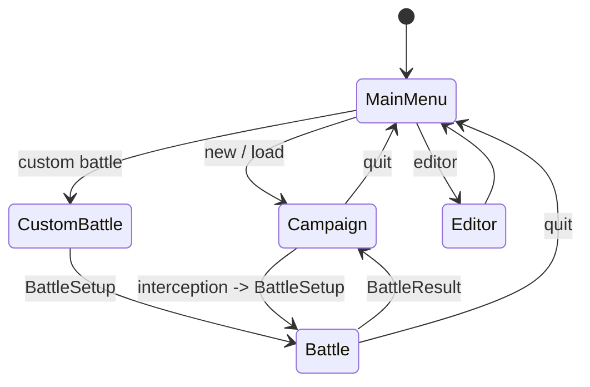
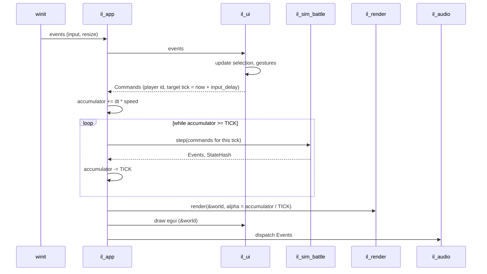
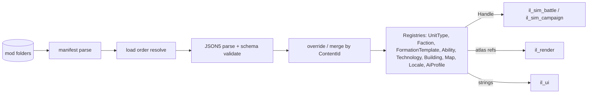

# Iron Legion Engine — Software Architecture Document

| | |
|---|---|
| **Version** | 0.1 |
| **Status** | Draft for review |
| **Upstream** | [PRD v0.2](01-prd.md) · [Glossary](00-glossary.md) |
| **Downstream** | [Simulation Spec](03-simulation-spec.md) · [TDD](04-tdd.md) · [Networking Spec](05-networking-spec.md) · [Modding SDK](06-modding-sdk-spec.md) |

## 1. Purpose and scope

This document describes the shape of the Iron Legion Engine: its crates, their allowed dependencies, the runtime loops, how data flows, how concurrency is handled, and the rules every subsystem must obey for determinism. It does not describe gameplay rules (Simulation Spec) or Rust-level types (TDD).

Readers: the engine author, a future contributor who needs to know where code goes and what it may touch.

The engine and the flagship game share one repository (REQ-VIS-020..023). This document treats them as one system with an internal boundary.

## 2. Architectural drivers

The requirements that most constrain the architecture, in priority order:

| Driver | Source | Architectural consequence |
|---|---|---|
| Bit-exact determinism from Commands and seed | REQ-SIM-001..009 | Simulation is a pure function `(state, commands) → state`; isolated headless crates; no wall-clock, no unordered iteration, no unseeded RNG, Scalar abstraction. |
| 20,000 to 32,768 individually simulated soldiers at 20 Hz | REQ-PERF-001..005 | Structure-of-arrays ECS storage, uniform spatial grid, hierarchy so that expensive decisions happen per Regiment not per Soldier, parallelism under determinism rules, per-system budgets. |
| Everything is data | REQ-VIS-004, REQ-MOD-001..007 | Content registry with typed handles; the flagship game is a mod; schema validation on load. |
| Future lockstep multiplayer with no rewrite | REQ-NET-001..003 | Command queue is the only sim input, tagged by player and tick; input delay is a first-class parameter; state hash and snapshot are Phase 0 features. |
| Solo developer | A-1 | Few crates with clear boundaries; prefer boring, well-maintained dependencies; testability over cleverness. |
| Simulation first | REQ-VIS-006 | Renderer and UI are consumers of read-only simulation state; they never gate the tick. |

## 3. Architectural principles

These make the PRD principles concrete. Every code review checks them.

1. **The sim is headless and pure.** `il_sim_battle` and `il_sim_campaign` depend only on `il_core`, `il_data`, and `il_ai`. They compile and run with no window, GPU, audio, or filesystem access. They are stepped by calling a function with a slice of Commands.
2. **Commands in, events out.** Nothing outside the sim mutates sim state. The sim emits an ordered list of Events per tick (soldier died, volley fired, regiment routed) that the renderer, audio, UI, and campaign consume. Events are derived from state; they are never an input.
3. **No wall-clock in the sim.** Time is ticks and turns. The app shell owns the accumulator and decides how many ticks to run.
4. **Ordered where it matters.** Any computation whose result depends on iteration order iterates in stable entity id order. Parallel work gathers results and applies them in that order.
5. **One RNG stream per system.** Systems draw from their own seeded stream. Adding or removing a random draw in one system never changes another system's results.
6. **All arithmetic through Scalar.** Sim code uses `S: Scalar` types, never bare `f32`. Today `S = f32`; later fixed-point (REQ-TECH-009, REQ-PLAT-004).
7. **Content through registries.** Sim code holds `Handle<UnitType>`, never strings or file paths. Registries are built once at load from the resolved mod set.
8. **Engine never depends on game.** `crates/il_*` never import `game/`. Game-specific Rust (rare, logged as open questions) implements engine traits.
9. **Budgets are requirements.** Every system declares a per-tick budget at 20k soldiers; the benchmark suite enforces them.
10. **Fail loudly at load, never at tick.** Content validation happens when mods load. Once a battle starts, missing data is a bug, not a runtime branch.

## 4. Context view



The system is a single desktop process. External actors are the player, mod authors (through files), the disk (saves, replays, content), and, in Phase 7, other peers.

## 5. Crate view

### 5.1 Workspace layout

```
IronLegionEngine/
  Cargo.toml                 workspace, MSRV, shared lints, profile settings (no fast-math)
  crates/
    il_core/                 ids, Scalar trait, Vec2/Angle, RNG streams, StateHash, Tick, Turn, Events base
    il_data/                 JSON5 loading, schema validation, mod manifest, load order, override/merge, registries, handles, localisation table
    il_sim_battle/           headless battle simulation: ECS world, components, systems, Commands, BattleSetup/BattleResult, snapshot, hash
    il_sim_campaign/         headless campaign simulation: turn engine, province graph, economy, diplomacy, research, recruitment, campaign Commands
    il_ai/                   utility-AI framework (considerations, scorers, action selection), soldier FSM types, deterministic
    il_render/               wgpu device, instanced sprite pipeline, terrain pipeline, isometric camera, LOD, interpolation, debug overlays
    il_ui/                   egui panels (battle, campaign, deployment, menus), input mapping -> Commands, selection model
    il_audio/                audio engine wrapper, event -> sound mapping, zoom-based mixing
    il_script/               mlua sandbox, Lua API surface, event hooks (Phase 6)
    il_save/                 snapshot container format, JSON header, schema versions, migrations, replay files
    il_net/                  lockstep session, transport trait, hash exchange, resync (Phase 7)
    il_editor/               map editor, unit editor, formation editor (Phase 3 / 6)
    il_app/                  binary: winit event loop, state machine, accumulator, wiring of all crates
    il_cli/                  binary: headless scenario runner, hash printer, benchmark driver, desync report tool
  game/
    mod.json5                the flagship game as a mod
    content/                 units, factions, formations, technologies, buildings, abilities, maps, locale, ai
    scripts/                 Lua (Phase 6)
    assets/                  sprites, atlases, sounds, music
    rules/                   Rust crate `game_rules` for game-specific rule implementations behind engine traits (expected to stay near-empty)
  docs/
  tests/                     workspace integration tests: determinism, scenario outcomes, content validation
  benches/                   criterion benchmarks per system at 2k/10k/20k
```

### 5.2 Dependency rules



Hard rules, enforced by `tests/tests/dep_rules.rs` (four tests over every `Cargo.toml`, all three dependency tables; cargo-deny is not used, T0-002):

- Sim crates (`il_core`, `il_data`, `il_ai`, `il_sim_battle`, `il_sim_campaign`) must not depend on `wgpu`, `winit`, `egui`, `egui-wgpu`, `egui-winit`, any audio crate (`kira`, `rodio`, `cpal`), `rand`, `glam`, `game_rules`, or any non-sim workspace crate (`il_render`, `il_ui`, `il_audio`, `il_app`, `il_cli`, `il_save`, `il_net`, `il_editor`, `il_script`). Clock and filesystem use are not manifest facts, so clippy carries them: `disallowed_methods` bans `Instant::now` and `SystemTime::now` in the sim crates and in `il_cli` (its bench `StageTimer` is the one marked exception, §9.3), and `il_sim_battle`'s clippy bans `std::fs` (the loader in `il_data` runs only at load).
- Presentation crates `il_render` and `il_ui` (and `il_audio` when it arrives) may depend on `il_core`, `il_data` and `il_sim_battle` and on nothing else in the workspace; `il_render` never depends on `winit`, `il_ui` never on `wgpu`. They read the sim only through `BattleWorld::view() -> BattleView` and never hold `&mut`.
- No `il_*` crate depends on `game/` or on `game_rules`.
- `il_sim_campaign` will depend on `il_sim_battle` only for the shared `BattleSetup` and `BattleResult` types (they live in `il_sim_battle::interface`).
- Every sim crate manifest must exist, so a renamed crate fails the test instead of escaping it.

### 5.3 Crate responsibilities and requirement coverage

| Crate | Responsibilities | Satisfies |
|---|---|---|
| `il_core` | Stable ids, `Scalar`, deterministic math, RNG streams, `StateHash`, `Tick`, `Turn`, event base types, tracing spans | REQ-TECH-009, REQ-TECH-010, REQ-SIM-004, REQ-SIM-005 |
| `il_data` | JSON5 parse, schema validation with diagnostics, manifest, load order, override/merge (including `$from` inheritance), `Registry<T>`, `Handle<T>`, `ContentId`, localisation strings, mod list hash and content registry hash (used by saves and multiplayer handshake), hot reload (dev) | REQ-VIS-004, REQ-MOD-001, 004..008, REQ-LOC-001, REQ-SAVE-002, REQ-TEST-005 |
| `il_sim_battle` | Battle ECS world; formation, movement, collision, combat, projectile, morale, fatigue, ability, visibility, battle-flow systems; Command application; Events; snapshot; hash; `BattleSetup`/`BattleResult` | REQ-SIM-*, REQ-FORM-*, REQ-PATH-001..007, 009, REQ-CMBT-*, REQ-ABIL-*, REQ-MOR-*, REQ-FAT-*, REQ-NET-001..003 |
| `il_sim_campaign` | Turn engine, provinces, armies, economy, diplomacy, research, recruitment, experience, battle trigger, `BattleResult` application, campaign Commands and Events, snapshot, hash | REQ-CAMP-*, REQ-PATH-008, REQ-SIM-002, REQ-SIM-062, REQ-SIM-064 |
| `il_ai` | Utility-AI core (considerations, response curves, action scoring, deterministic tie-break), soldier FSM types, decision cadence helpers | REQ-AI-001, 002, 005, 006, 007 |
| `il_render` | wgpu setup, atlases, instance buffers, isometric projection, camera, interpolation, LOD tiers, terrain, projectiles, debug overlays, profiler overlay | REQ-RNDR-*, REQ-TOOL-003 |
| `il_ui` | egui panels, selection, input mapping, drag-formation gesture, Command emission, minimap, cards | REQ-UI-*, REQ-INP-* |
| `il_audio` | Event-driven sound playback, zoom mixing, music state | REQ-AUD-* |
| `il_script` | Lua sandbox, API bindings for campaign events, missions, triggers | REQ-MOD-002, 003, REQ-TECH-007 |
| `il_save` | Save container, header, versioning, migrations, replay format | REQ-SAVE-*, REQ-TECH-006 |
| `il_net` | Lockstep session, transport trait, input delay, hash exchange, resync | REQ-NET-004..007 |
| `il_editor` | Map editor, unit editor, formation editor | REQ-TOOL-004, 005, REQ-MOD-009 |
| `il_app` | Window, event loop, app state machine, accumulator, wiring | REQ-SIM-021, REQ-RNDR-003 |
| `il_cli` | Headless runner, hash printing, benchmarks, desync report | REQ-TOOL-001, 002, 007, REQ-TEST-002 |

## 6. Runtime view

### 6.1 App states and frame loop



Per frame in the Battle state:



Rules:

- `TICK` is exactly 50 ms of sim time. Speed multipliers scale the accumulator, not the tick length (REQ-SIM-031). Pause sets the multiplier to 0 but is also recorded as a Command so replays and peers see it.
- Commands are stamped with the tick at which they execute. In single-player, `input_delay` is 0 or 1; in lockstep it is tuned (REQ-NET-002).
- If the sim falls behind (accumulator grows beyond N ticks), the app caps catch-up ticks per frame and lets the sim speed drop rather than spiralling. This is visible in the profiler.
- The renderer reads the last two tick states (double-buffered position and facing components) and interpolates by `alpha`.

### 6.2 Simulation step

`step(commands)` runs a fixed schedule of stages. Ordering between stages is total; within a stage, systems may run in parallel only if they do not write the same components and are order-independent (see §8).

```
Stage 0  ApplyCommands        commands sorted by (tick, player id, sequence); mutate orders/regiment state
Stage 1  AI                   regiment and army utility AI (staggered cadence) -> emits internal Commands for next tick
Stage 2  Formation            recompute slot layouts for regiments whose count/template/facing changed; reform assignment
Stage 3  RegimentMovement     path following, anchor movement, wheeling
Stage 4  SoldierSteering      seek slot / flow field, separation, obstacle avoidance -> desired velocity
Stage 5  Integrate            position += velocity * dt; clamp to map
Stage 6  SpatialGrid          rebuild buckets from positions
Stage 7  Collision            circle-circle push resolution (deterministic pairs order)
Stage 8  Visibility           regiment LOS, fog of war per faction
Stage 9  Targeting            melee target selection, ranged target selection
Stage 10 Combat               attack cycles, hit rolls, damage, projectile spawn
Stage 11 Projectiles          integrate arcs, landing checks, damage
Stage 12 Abilities            cooldowns, effect application, status expiry
Stage 13 Fatigue              accumulate/recover
Stage 14 Morale               factors, thresholds, rout/rally/shatter transitions
Stage 15 Death                remove dead soldiers, update regiment counts, mark reform needed
Stage 16 BattleFlow           phase transitions, victory check, pursuit, timers
Stage 17 Events + Hash        flush ordered Events; compute StateHash; swap interpolation buffers
```

The exact system list per stage is owned by the TDD; this ordering is architectural and changing it is an ADR.

### 6.3 Campaign turn

```
PlayerPhase        player issues campaign Commands (move, recruit, build, diplomacy, research, end turn)
AIPhase            for each AI faction in fixed order: utility AI -> campaign Commands
Resolution         movement (province graph), interceptions -> battles (each yields BattleResult, applied immediately),
                   economy, research, recruitment, replenishment, diplomacy attitude update, events (Lua hooks, Phase 6)
EndTurn            hash, autosave, advance turn counter
```

Battles inside `Resolution` are run by the app: the campaign emits a `BattleRequested(BattleSetup)` event, the app switches to the Battle state, and when a `BattleResult` arrives the app feeds it to the campaign as a Command (`ApplyBattleResult`). This keeps the campaign sim headless and makes auto-resolve just another producer of `BattleResult`.

### 6.4 Campaign ↔ battle contract

- `BattleSetup` and `BattleResult` are plain serialisable structs in `il_sim_battle::interface` (REQ-SIM-060, 061).
- `BattleSetup` is self-contained: it includes the seed and every Content ID needed. Given the same mod set it fully determines the battle.
- The campaign never reads battle internals; it only receives `BattleResult` (REQ-SIM-062).
- Custom battles and scenario tests construct `BattleSetup` from a JSON5 file (REQ-SIM-063).

## 7. Data view



- **Registries** are immutable after load in release builds. In dev builds hot reload swaps a registry's contents in place; handles stay valid because they index by ContentId-assigned slot (REQ-MOD-008).
- **Handles** are `u32` indices plus a type marker. The ECS stores handles, never strings.
- **Saves** store snapshots of ECS worlds plus the list of mods and versions that produced the registries. On load, registries are rebuilt from the mod set, then the snapshot is restored; handles are re-resolved by ContentId during restore so a mod that reorders content does not corrupt a save (REQ-SAVE-004).
- **Replays** are `BattleSetup` plus the per-tick Command log plus optional snapshots every N ticks for seeking (REQ-SAVE-005).
- **Localisation** is a registry keyed by string id with per-locale tables; UI code calls `loc("battle.deploy.confirm")` (REQ-LOC-001).

## 8. Concurrency model

Two threads by default, more inside the sim step:

| Thread | Owns | Notes |
|---|---|---|
| Main | winit loop, `il_app` state machine, accumulator, sim stepping, egui | Sim stepping stays on main until Phase 3; the render thread reads a double-buffered copy. |
| Render (Phase 3, REQ-RNDR-007) | wgpu queue, instance buffer build, present | Receives an immutable render snapshot (positions ×2, facings ×2, LOD inputs) each frame. Never touches the ECS. |
| Sim worker pool | `bevy_ecs` schedule parallelism inside a stage | Bounded to physical cores minus one. |

Determinism rules for parallelism inside the sim (REQ-SIM-007, 008):

1. Systems in the same stage may run in parallel only if `bevy_ecs`'s access analysis shows no write conflict *and* the system's own output does not depend on cross-entity read order.
2. Any system that produces per-entity results from neighbour queries (collision push, targeting) computes results into a per-entity buffer in parallel, then applies them in stable id order in a single-threaded apply step.
3. Reductions (sum casualties per regiment) use fixed-order sequential folds, or parallel folds over stable-id-sorted chunks with a fixed combination tree.
4. `par_iter` is allowed for embarrassingly parallel per-entity updates that read only their own components and immutable resources (integrate positions, fatigue accumulation).
5. Floating-point reductions across threads are forbidden unless the combination order is fixed.
6. The determinism CI test runs with 1 thread and with N threads and compares hashes.

## 9. Cross-cutting concerns

### 9.1 Determinism rules (summary; the TDD carries the checklist)

- No `Instant::now()`, `SystemTime`, `HashMap` iteration, `thread_rng`, or pointer-address-dependent ordering in sim crates. `HashMap` is allowed for lookup only; iteration uses `BTreeMap` or sorted `Vec`.
- Entity ids used for ordering are the sim's own stable `SoldierId`/`RegimentId` (monotonic, never reused within a battle), not `bevy_ecs::Entity`.
- All trig and sqrt go through `Scalar` methods so a fixed-point implementation can substitute table-driven versions.
- Compiler: `-C target-cpu` is never set for sim crates in release profiles; no `fast-math` style flags; SIMD only via explicit, deterministic code paths (none planned).

### 9.2 Error handling

- Content errors are collected, not short-circuited: the loader reports all diagnostics (file, line, column, field, expected) then fails (REQ-MOD-007).
- The sim uses `Result` only at boundaries (`BattleSetup` validation, snapshot restore). Inside the tick, invariants are `debug_assert!`; a violated invariant in release is logged once and the sim continues, because a crash mid-battle is worse than a glitch.
- App-level errors (device lost, file IO) surface as UI dialogs, never panics.

### 9.3 Logging, tracing, profiling

- Per-stage timings come from `BattleWorld::step_observed(&mut self, commands: &[Command], observer: &mut dyn StageObserver) -> StepOutput`: the sim calls `begin(stage)` / `end(stage)` around each of its 18 per-stage schedules and never reads a clock (plain `step` passes a `NoopObserver`). Two observers exist: `il_app::profiler::Profiler` (`Instant` around every stage, a 60-tick window, `frame(frame_seconds, ticks_stepped)` and `stats() -> il_ui::ProfilerStats` for the overlay; REQ-TOOL-003, T1-060) and `il_cli::bench::StageTimer` (every sample kept, mean/p95/max per stage in the bench report; the one clippy-allowed clock read in il_cli, T1-080). No `tracing` layer: a per-system layer over bevy_ecs's `trace` feature was considered and rejected (a global subscriber and a mutex per span exit for detail the stage observer already gives). `tracing` itself is only used for the missing-locale-key warning.
- Log levels: sim emits `debug` only in dev builds; Events are the sanctioned way to observe the sim.
- Benchmarks (REQ-TOOL-002, T1-080): `il_cli bench --soldiers 2000|10000|20000` on a generated move/reform setup, compared against `benches/baseline.json` (`--strict` fails at +20 % on the target machine, CI warns), plus criterion micro-benches `spatial`, `formation`, `nav`, `layout`, `tick` under `benches/benches/`. Measured Phase 1 stage costs are in the TDD budget table.

### 9.4 Hot reload (dev only)

- `il_data` watches mod folders; on change it re-runs the whole load pipeline (under one second for the flagship) laid out like the running registries, so every old id keeps its index, deleted ids stay as removed slots and new ids append; the app swaps the new `Arc<Registries>` into the sim between ticks (T1-025). Registries themselves stay immutable. Sim reads registries by handle each tick, so new numbers apply next tick. Structural changes (new unit types) take effect at next battle load; a failing edit keeps the previous registries and reports the diagnostics.

### 9.5 Localisation and assets

- Strings through `il_data` locale registry. Sprites and audio referenced by ContentId in unit type definitions; `il_render` and `il_audio` load them via asset paths resolved by `il_data` against the mod's `assets/` root.

## 10. Quality scenarios

| Attribute | Scenario | Response measure |
|---|---|---|
| Performance | 20,000 soldiers, 200 regiments, all systems active, mid-battle melee along a 2 km front | Sim tick ≤ 50 ms on target CPU; render ≥ 30 FPS |
| Determinism | Same scenario run on two Windows machines, same build | Identical hash per tick for 20,000 ticks |
| Determinism | Snapshot at tick 5,000, restore in a fresh process, run to 10,000 | Hash at 10,000 identical to uninterrupted run |
| Modifiability | Add a new morale factor | Change in one system plus one data field; no other crate touched |
| Modifiability | Replace `f32` with fixed-point | Only `il_core::scalar` and its tests change; gameplay code recompiles |
| Testability | Verify a hit-roll formula | Unit test in `il_sim_battle` with no window or GPU |
| Moddability | Override a unit's armour from a mod | Drop a JSON5 file with the same ContentId and a `merge` directive; no restart in dev |
| Availability | GPU device lost during battle | Renderer recreates device; sim unaffected; battle continues |

## 11. Decision log

| ADR | Decision | Context and consequences |
|---|---|---|
| ADR-001 | Use `bevy_ecs` standalone, not the Bevy app | Full control of the fixed-step loop and renderer; we own scheduling determinism. Consequence: we write our own asset, input, and render layers. |
| ADR-002 | Custom wgpu renderer | Instanced sprite rendering at 20k+ is simpler to control directly than through Bevy's 2D renderer. Consequence: more code, no Bevy render features. |
| ADR-003 | `f32` behind a `Scalar` trait | Fast to build, deterministic on one platform; fixed-point swap path preserved. Consequence: discipline in sim code (no bare floats). |
| ADR-004 | Fixed 20 Hz tick, render interpolation | Standard lockstep rate; halves cost versus 60 Hz sim. Consequence: melee timing is quantised to 50 ms. |
| ADR-005 | Commands are the only sim input; Events the only output | Enables replays, lockstep, and headless tests. Consequence: UI and AI must express everything as Commands. |
| ADR-006 | Regiments path, soldiers steer | Pathfinding cost scales with regiments (~200), not soldiers (20k). Consequence: detached soldiers use flow fields, never A*. |
| ADR-007 | Regiment-level morale | Cheap and predictable; matches the "intelligence above soldiers" principle. Consequence: no partial routs. |
| ADR-008 | Simulated projectiles with cap and statistical fallback | Preserves flight time and friendly fire; cap bounds worst case. Consequence: two code paths that must produce equivalent expected casualties. |
| ADR-009 | JSON5 content, binary snapshots | Modder-friendly content with comments; compact fast saves. Consequence: two serialisation formats to maintain. |
| ADR-010 | Lua 5.4 via mlua, never inside the battle tick (MVP) | Keeps battle determinism a Rust-only problem. Consequence: battle-behaviour mods are data-only. |
| ADR-011 | Flagship game packaged as a mod | One content path, forces the loader to be complete. Consequence: engine ships with no built-in content. |
| ADR-012 | Peer-to-peer lockstep with host tiebreaker | No servers to run for a hobby project. Consequence: NAT traversal and host-authoritative resync. |
| ADR-013 | Uniform spatial grid over quadtree | Predictable cost, trivially deterministic, cache-friendly for uniform soldier density. Consequence: memory proportional to map area. |
| ADR-014 | Utility AI with data-defined considerations | Deterministic, cheap, moddable through weights. Consequence: emergent but sometimes opaque behaviour; needs debug visualisation. |
| ADR-015 | Isometric fixed-pitch with snap rotation | Sprite art with 8 facings is tractable; free rotation is not. Consequence: PRD "smooth rotation" removed. |

## 12. Risks and technical debt register

| # | Item | Type | Owner | Plan |
|---|---|---|---|---|
| T-1 | `bevy_ecs` API churn between minor versions | Risk | il_sim_battle | Pin version per phase; upgrade only at phase boundaries. |
| T-2 | Double-buffered interpolation components double position memory | Debt | il_render | Acceptable at 32k entities (a few MB); revisit if memory budget (REQ-PERF-007) is threatened. |
| T-3 | Statistical projectile fallback must match simulated expected value | Risk | Simulation Spec §6 | Scenario tests compare casualty distributions between the two paths. |
| T-4 | Hash cost per tick at 32k entities | Risk | il_core | Hash only components in the documented set; measure; allow hashing every N ticks in release with full hash in tests. |
| T-5 | Sim on main thread until Phase 3 | Debt | il_app | `RenderSnapshot` (owned data, built after stepping) exists since T1-052, so moving to a render thread is plumbing only. |
| T-6 | Game-specific Rust in `game/rules` | Debt | game | Each addition logged as an open question in the PRD for generalisation. |
| T-7 | `RegimentSetup.position` and `facing_deg` place regiments directly because deployment zones do not exist yet (Phase 0) | Debt | il_sim_battle | Remove in T2-070 when `Deploy` and deployment zones arrive; PRD OQ-9 decides whether a scenario-file override survives. |
| T-8 | `ComputeTaskPool` is process-global, so the first `set_threads(n > 1)` fixes the worker count for the process | Debt | il_sim_battle | Acceptable for the app (one pool) and the tests (single N); revisit if a tool needs two pool sizes in one process. |
| T-9 | Ten of the 18 stages (1, 8, 10..16 (Stage 9 got its systems in T2-020)) run an empty placeholder system so the profiler shows every row; together they cost ≈ 0.3 ms of schedule overhead per tick at 20k | Debt | il_sim_battle | Each placeholder is replaced by its real systems in Phase 2; if any stage stays empty after that, drop its schedule. |
| T-10 | At 20k soldiers `Collision` (11.2 ms) and `SoldierSteering` (7.7 ms) already sit at their Phase 3 budgets (TDD budget table, T1-083) | Risk | il_sim_battle | Phase 2 combat must not grow them; candidates are a narrower pair neighbourhood, fewer `collision_iterations` when nobody moved and per-row buffers reused across ticks. |
| T-11 | Lint opt-outs: `il_render` (`unsafe_code = "deny"` for the wgpu surface, `float_arithmetic = "allow"`), `il_ui` and `il_app` (`float_arithmetic = "allow"`); `il_cli::bench::StageTimer` allows `Instant::now`; `il_sim_battle` declares `tracing` without using it | Debt | presentation crates | Each carries its reason in the manifest or attribute; the render-side float allowance is by design (no sim arithmetic there). Drop `tracing` from il_sim_battle when the next dependency pass happens. |
| T-12 | `il_ai`, `il_save`, `il_sim_campaign` and `game/rules` are empty placeholder crates, so several §5.2 edges cannot be enforced yet | Debt | workspace | Filled by their phases; `dep_rules.rs` already lists them so the rules apply the moment they gain dependencies. |
| T-13 | Hot reload reads manifests at startup only (`ReloadEvent::ManifestIgnored`) and debounces by poll count (`QUIET_POLLS` = 6) rather than time | Debt | il_data | Acceptable for a dev feature; a manifest change needs a restart. |
