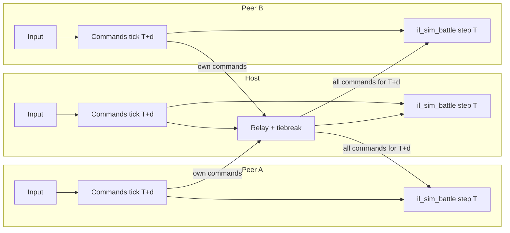
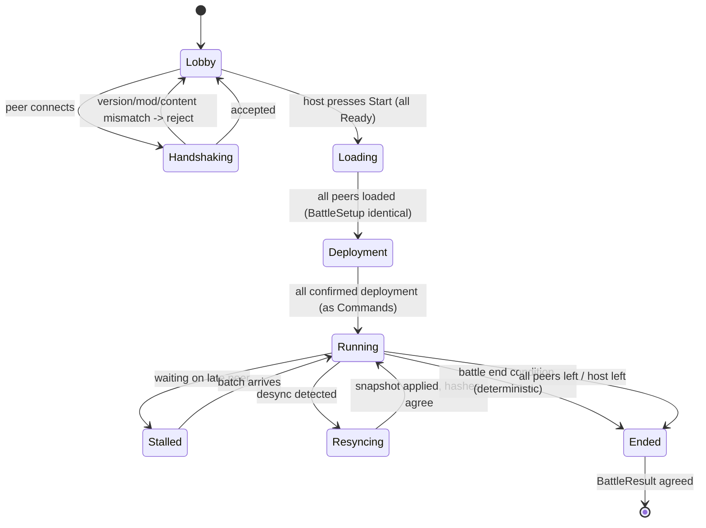
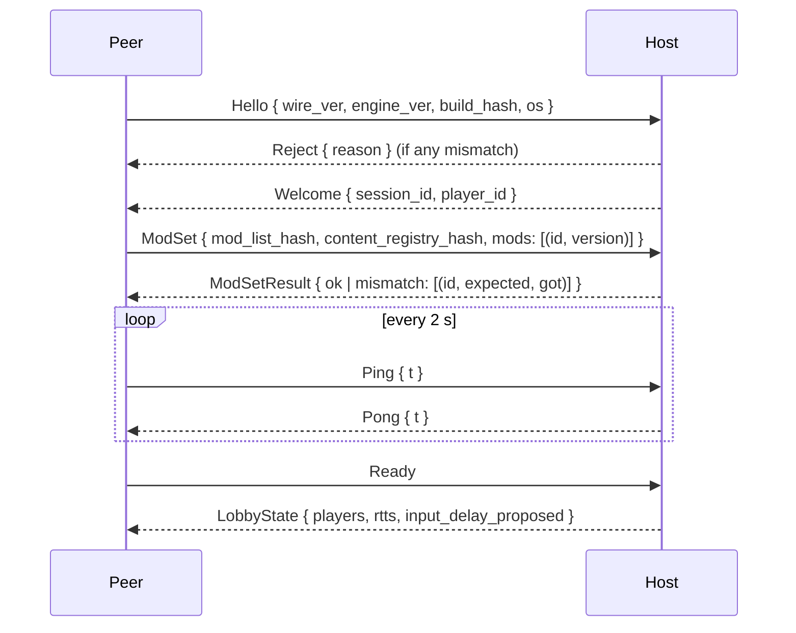

# Iron Legion Engine — Networking Architecture Spec

| | |
|---|---|
| **Version** | 0.1 |
| **Status** | Draft for review |
| **Upstream** | [PRD v0.2](01-prd.md) · [SAD](02-sad.md) · [Glossary](00-glossary.md) |
| **Downstream** | [TDD](04-tdd.md) §4 (Command, StateHash, Snapshot types) · `il_net` crate |
| **Phase** | 7 (design only until then; §9 lists what earlier phases must already do) |

## 0. Purpose

This document specifies how Iron Legion Engine battles (and, as a stretch, campaigns) are played between 2 to 4 peers over a network. It relies entirely on the deterministic simulation described in the [SAD](02-sad.md) §3 and §8: peers exchange only *Commands* and *State Hashes*, never entity state. Terms in this document (Lockstep, Command, Input delay, Host, Desync, Snapshot, State Hash, Tick) are defined in the [Glossary](00-glossary.md).

Nothing in this document is implemented before Phase 7. Everything in §9 must be true from Phase 0.

---

## 1. Goals and non-goals

### 1.1 Goals

| ID | Goal | Priority | Satisfies |
|---|---|---|---|
| NG-1 | 2 to 4 human players in one battle, each controlling one Army, any mix of sides. | Must | REQ-NET-004 |
| NG-2 | Peer-to-peer lockstep with one peer acting as Host: relay, tiebreaker, authoritative Snapshot on Desync. | Must | REQ-NET-004, REQ-NET-006 |
| NG-3 | Playable at up to 150 ms round-trip time (RTT) between any two peers; degrades gracefully (increased input delay, no stalls) up to 250 ms RTT; beyond that the session may stall but must not Desync. | Must | — |
| NG-4 | Bandwidth per peer under 8 kB/s in a 4-player 20,000-soldier battle at 20 Hz. Commands are tiny; state is never sent. | Must | — |
| NG-5 | Desync is detected within 10 ticks in release builds and within 1 tick in debug builds, and recovered from without ending the battle. | Should | REQ-NET-006 |
| NG-6 | Transport is a trait; UDP with a reliability layer and Steam Datagram Relay are candidate implementations. | Should | REQ-NET-007 |
| NG-7 | Two-player head-to-head campaign. | Could | REQ-NET-005 |
| NG-8 | Replays and spectators fall out of the same command log and Snapshot machinery. | Should | REQ-SAVE-005 |

### 1.2 Non-goals

- Dedicated servers, matchmaking services, ranked ladders, accounts.
- More than 4 players per battle, or more than 2 players per campaign.
- Anti-cheat beyond what a peer-to-peer trust model allows (§8).
- Hiding fog-of-war information from a modified client (§8.4).
- Cross-platform play before REQ-PLAT-004 (fixed-point Scalar) is in place. Until then all peers must run the same build on the same OS (REQ-PLAT-003).
- Real-time (non-lockstep) campaign synchronisation.

### 1.3 Latency budget

At 20 Hz one Tick is 50 ms. Input delay `d` ticks gives `d × 50 ms` to deliver a Command to every peer before the tick that executes it.

| Network | RTT | One-way | Required `input_delay` | Perceived order latency |
|---|---|---|---|---|
| LAN | < 10 ms | < 5 ms | 3 (default LAN) | 150 ms |
| Good internet | 60–100 ms | 30–50 ms | 3–4 | 150–200 ms |
| Target ceiling | 150 ms | 75 ms | 4–5 | 200–250 ms |
| Degraded | 250 ms | 125 ms | 6 (default internet) | 300 ms |

Perceived latency of 200–300 ms is acceptable for a regiment-command game; it is comparable to shipped RTS titles and far below the time a Regiment needs to react to an order.

---

## 2. Lockstep model

### 2.1 Overview

Every peer, including the Host, runs the full `il_sim_battle` simulation. There is no separate "network turn"; the lockstep unit is one Tick. A Tick `T` may be stepped on a peer only once that peer holds the Command set of **every** player for Tick `T`. Because the simulation is deterministic (REQ-SIM-001), all peers then produce the same State Hash for `T`.



The Host is a relay so that each peer maintains one connection, not N−1. Peers may additionally open direct connections (§3.3) but the Host copy of the command stream is canonical.

### 2.2 Command type (verbatim, shared with the TDD)

```rust
pub struct Command {
    pub tick: u32,          // tick at which this command executes
    pub player: PlayerId,   // PlayerId(u8); 0 = host, 255 = system/AI-less
    pub seq: u16,           // per-player, per-tick sequence number
    pub kind: CommandKind,  // the order itself
}
```

Execution order inside a Tick is the total order `(tick, player, seq)` (REQ-NET-001). This order is the same on every peer regardless of arrival order, which is what makes relay reordering harmless.

`CommandKind` is the same enum used in single-player (SAD §6.1). Networking adds no variants; it adds the following meta-frames which are **not** Commands and never enter the simulation:

| Frame | Direction | Purpose |
|---|---|---|
| `CmdBatch { tick, player, commands: Vec<Command> }` | peer → host → peers | All Commands one player issued for one tick. Sent even when empty (an empty batch is the "I have nothing for tick T" signal). |
| `Hash { tick, hash: StateHash }` | peer → host | Determinism verification (§5). |
| `Stall { waiting_on: Vec<PlayerId>, tick }` | host → peers | UI hint while waiting. |
| `Resync { snapshot_tick, snapshot: Snapshot }` | host → peer | Desync recovery (§5.4). |
| `Control` | any | Lobby, handshake, ready, leave (§4). |

### 2.3 Input delay

`input_delay: u8` is a session parameter (REQ-NET-002). When a player issues an order at local Tick `now`, the Command is stamped `tick = now + input_delay` and broadcast immediately. In single-player `input_delay` is 0 or 1, so the same code path is exercised every day.

**Initial value.** The Host picks it at session start from the worst measured RTT during the lobby:

```
input_delay = clamp(ceil((max_rtt_ms / 2 + jitter_ms + 15) / 50), 3, 8)
```

Defaults when RTT is unknown: 3 (LAN), 6 (internet).

**Adaptive policy.** The Host samples per-peer "slack" every 20 ticks: how many ms before the deadline each peer's batch for the next executable tick arrived. If any peer's slack is negative more than 3 times in 100 ticks, the Host issues a `Control::SetInputDelay { from_tick, value: d + 1 }`. If every peer's minimum slack over 400 ticks exceeds 60 ms, it issues `d − 1` (never below 3). The change takes effect at `from_tick`, which is at least `d + 2` ticks in the future so every peer has already stamped the intermediate ticks. Because the input delay is a stamping rule, not simulation state, changing it does not affect determinism. The algorithm's constants are OQ-N3.

### 2.4 Tick scheduling and stall rules

Each peer keeps:

| Field | Meaning |
|---|---|
| `sim_tick` | Last tick stepped by `il_sim_battle`. |
| `have_all[T]` | True when a `CmdBatch` (possibly empty) has arrived from every player for tick `T`. |
| `local_clock` | Wall-clock accumulator, as in single-player (SAD §6.1). |

Step rule: at most one tick per 50 ms of accumulated `local_clock × speed`, and only if `have_all[sim_tick + 1]`. If the accumulator wants to step but the batch is missing, the peer **stalls**: it renders the last interpolated frame, shows the `Stall` overlay after 250 ms, and does not advance. There is no prediction and no rollback; the simulation is never speculated.

The Host declares a peer *late* when its batch for the next tick has not arrived 100 ms after the deadline, and *timed out* after `disconnect_timeout` (default 10 s, §4.5). Late peers just cause a stall. Timed-out peers are removed (§4.5); their Regiments are handed to the Host's AI, which is deterministic on all peers (§2.7).

Speed multipliers (REQ-SIM-031) apply to the accumulator on every peer identically because they are Commands (§2.6); a fast peer simply waits on `have_all`.

### 2.5 Command serialisation and size budget

Commands are serialised with the same `postcard`/`bincode` codec chosen for Snapshots (OQ-2). Budget per `CmdBatch`:

| Item | Bytes |
|---|---|
| Frame header (type, tick, player, count) | 8 |
| Typical `Command` (move: regiment ids, target, facing) | 12–24 |
| Drag-formation for 20 regiments | ~400 |
| Worst realistic batch | < 1,200 (fits one MTU-safe packet, §3.4) |

A player issuing more than 64 Commands in one tick is rate-limited by the UI layer (§8.2). Batches larger than the MTU-safe payload are split across reliable packets and reassembled by the transport.

### 2.6 Pause and speed as Commands

`CommandKind::SetSpeed(multiplier)` and `CommandKind::Pause`/`Resume` travel through the command stream like any order and are therefore delayed by `input_delay` and executed on all peers at the same tick. This means a pause request takes `d` ticks to take effect. During pause, empty `CmdBatch` frames continue at a reduced 5 Hz "heartbeat" so `have_all` keeps advancing and unpausing is instant when it arrives. Any player may pause; the Host may set a per-session cap on pauses per player (lobby option).

### 2.7 AI Commands in multiplayer

**All peers run the AI.** Because AI decisions are deterministic functions of simulation state and the AI RNG stream (REQ-AI-005, SAD stage 1), every peer produces identical AI Commands for AI-controlled Armies. AI Commands are issued with `PlayerId(255)` and are appended to the tick's Command list locally on every peer; they are **never** sent over the network and are **not** part of `have_all`. The Host does nothing special. This also covers Regiments orphaned by a disconnected player (§4.5): every peer switches them to AI control at the same tick because the removal itself is a `Control` frame converted to a Host-issued `Command::TransferControl { from, to: PlayerId(255), tick }`.

### 2.8 Host tiebreak

Only two decisions need a tiebreaker, and both are outside the simulation:

1. **Session parameters**: `input_delay`, `disconnect_timeout`, speed cap. The Host's values win and are broadcast as `Control` frames.
2. **Divergence**: when hashes differ, the Host's state is correct by definition (§5.4).

Nothing about Command ordering needs the Host: `(tick, player, seq)` is a total order.

---

## 3. Transport abstraction

### 3.1 Trait

```rust
pub trait Transport: Send {
    /// Fire-and-forget. May drop, reorder, duplicate. Used for Hash frames and Stall hints.
    fn send_unreliable(&mut self, to: PeerId, payload: &[u8]) -> Result<(), NetError>;

    /// Delivered exactly once, in order per (from, to) pair. Used for CmdBatch, Control, Resync.
    fn send_reliable(&mut self, to: PeerId, payload: &[u8]) -> Result<(), NetError>;

    /// Drain received frames and connection events. Non-blocking.
    fn poll(&mut self, out: &mut Vec<TransportEvent>);

    /// Currently connected peers.
    fn peers(&self) -> &[PeerId];

    /// Last measured RTT to a peer, if known.
    fn rtt(&self, peer: PeerId) -> Option<Duration>;

    fn disconnect(&mut self, peer: PeerId);
}

pub enum TransportEvent {
    Connected(PeerId),
    Disconnected(PeerId, DisconnectReason),
    Data { from: PeerId, payload: Vec<u8> },
}
```

`PeerId` is a transport-level identity (socket, Steam ID). `PlayerId` is assigned by the Host in the lobby and mapped to `PeerId` in the session table. The simulation never sees `PeerId`.

The trait is the only surface `il_net` uses; the session layer (§4) and lockstep layer (§2) are transport-agnostic and are tested against an in-process loopback transport with configurable latency, jitter, and loss.

### 3.2 Candidate implementations

| Implementation | Crate candidates | Pros | Cons | Status |
|---|---|---|---|---|
| Loopback (test) | none | Deterministic tests of stall, late, loss paths | Not real | Phase 7, first |
| UDP + reliability layer | `laminar`, `quinn` (QUIC), or in-house ack/resend over `std::net::UdpSocket` | No platform lock-in; QUIC gives reliability, ordering, and encryption for free | NAT traversal needed (§3.3); QUIC certificate handling | Phase 7 |
| Steam Datagram Relay | `steamworks` crate | Solves NAT, matchmaking, identity; encrypted | Steam-only; requires an App ID | Post-7, if the game ships on Steam |

Recommendation for first implementation: QUIC via `quinn` with self-signed certificates pinned during the lobby handshake, because it provides both reliable and unreliable (datagram extension) channels over one connection. Final choice is OQ-N1.

### 3.3 NAT considerations

- The Host must be reachable. Options: manual port forward, UPnP request at session start, or a relay (Steam). The engine shows the Host's external address and a reachability test result in the lobby.
- Non-host peers only need outbound connectivity to the Host.
- Optional direct peer-to-peer links (to reduce relay hop latency) are an optimisation for later; the Host relay is always the fallback and the canonical order.

### 3.4 MTU and packet layout

Every packet is ≤ 1,200 bytes of payload to stay under the common 1,280-byte IPv6 minimum MTU with headers.

```
+------+--------+---------+------------------------------+
| ver  | frame  | length  | frame body (postcard)        |
| u8   | u8     | u16     | ...                          |
+------+--------+---------+------------------------------+
```

Multiple small frames (e.g. `CmdBatch` + `Hash`) may be coalesced into one packet by the session layer before calling the transport. `ver` is the wire protocol version; peers with different `ver` refuse to connect during handshake.

---

## 4. Session lifecycle

### 4.1 States



### 4.2 Lobby and handshake



Checks, all mandatory:

| Check | Why |
|---|---|
| `wire_ver` equal | Frame layout compatibility. |
| `engine_ver` and `build_hash` equal | Determinism requires the same binary (REQ-PLAT-003); until fixed-point Scalar (REQ-PLAT-004) also the same OS. |
| `mod_list_hash` equal | Same mods, same versions, same load order (REQ-SAVE-004 logic reused). |
| `content_registry_hash` equal | Same *resolved* registries after override/merge; catches locally edited content. |

`content_registry_hash` is computed by `il_data` over the serialised registries in ContentId order and is also stored in saves; it is cheap because it is computed once at load.

### 4.3 BattleSetup distribution and start

1. The Host builds a `BattleSetup` (from a custom-battle lobby form or from the campaign, §6). It sets `seed` from OS entropy **once**; the seed is part of the setup, so it is the only nondeterministic input and it is shared.
2. The Host sends `Control::Setup { battle_setup }` reliably to all peers.
3. Each peer loads the battle headlessly, then replies `Loaded { setup_hash, initial_state_hash }`. The Host verifies both match its own; a mismatch aborts to the lobby with a diagnostic (this catches asset or content divergence that the registry hash missed).
4. The Host sends `Control::Start { first_tick: 0, input_delay, start_at: host_now + 500 ms }`. Peers begin stamping Commands at `tick = 0 + input_delay`; ticks 0..input_delay−1 have empty batches pre-filled on all peers.

The deployment phase (REQ-SIM-030) runs under lockstep: placements and the confirm button are ordinary Commands, so all peers see the same deployment and end the phase at the same tick.

### 4.4 Running

Per local tick the session layer:

1. Collects local Commands stamped `now + input_delay`, wraps in `CmdBatch`, sends reliable to Host (Host: to all peers).
2. Host forwards each received `CmdBatch` to all other peers.
3. Marks `have_all[T]` when batches from all human players are present.
4. Steps the sim when allowed (§2.4), appends AI Commands locally (§2.7), records `StateHash` and, per cadence (§5.1), sends `Hash`.
5. Appends `(T, all commands)` to the local replay log (§7).

### 4.5 Disconnect, timeout, rejoin

| Event | Handling |
|---|---|
| Peer misses batches for `disconnect_timeout` (default 10 s, lobby option 5–60 s) | Host broadcasts `Control::PlayerDropped { player, at_tick }`. Every peer converts this into `Command::TransferControl { from: player, to: PlayerId(255), tick: at_tick + input_delay }` issued as `PlayerId(0)` so it is ordered identically. The dropped player's Regiments become AI-controlled. Ticks stalled waiting for the dropped player are unblocked by treating its batches as empty from `at_tick` on. |
| Dropped peer reconnects within `rejoin_window` (default 120 s) | Handshake again; Host sends `Resync { snapshot_tick, snapshot }` (latest Host snapshot, taken every 100 ticks) plus all `CmdBatch` frames since `snapshot_tick`. Peer restores, replays Commands to the Host's current tick (fast-forward, no rendering), then the Host issues `TransferControl` back to the player. |
| Host disconnects | The battle ends for everyone with `BattleResult::Aborted` unless host migration is implemented (OQ-N2). |
| Peer leaves voluntarily | Same as timeout, immediate. |

### 4.6 End and BattleResult agreement

The battle ends deterministically (REQ-SIM-032), so every peer computes the same `BattleResult` from `il_sim_battle::interface`. Each peer sends `Control::Result { result_hash }`. If all agree, the result is final. If any peer disagrees (an undetected desync in the last ticks), the Host's `BattleResult` is authoritative and is sent in full (REQ-NET-006 policy applied to the final state). The result is then handed to the campaign (§6) or the custom-battle summary screen.

---

## 5. Determinism verification

### 5.1 Hash exchange cadence

The simulation computes `StateHash(u64)` at the end of every tick (REQ-SIM-005, SAD stage 17). Networking decides how often to *exchange* it:

| Build | Cadence | Hash covered components |
|---|---|---|
| Debug / dev | every tick | full documented set |
| Release | every 10 ticks: hash of the tick | full documented set |
| Release | every 100 ticks: `FullHash` frame that also carries per-stage sub-hashes (18 × u64) | enables §5.3 first-divergent-stage localisation |

Peers send `Hash` frames to the Host unreliably; loss is tolerated because the next one arrives 500 ms later. The Host keeps a ring buffer of the last 200 ticks of its own hashes for comparison.

### 5.2 Divergence detection

The Host compares every received `Hash { tick, hash }` with its own for `tick`. On the first mismatch from peer `P` at tick `T`:

1. Host requests `HashRange { from: T − 10, to: T }` reliably from `P` (peers also keep the ring buffer). This finds the exact first divergent tick `T0` within the release cadence gap.
2. Host records a desync report (§5.5) and begins resync (§5.4).
3. Other peers whose hashes still match are unaffected.

Detection latency: ≤ 1 tick in debug, ≤ 10 ticks plus one RTT in release (NG-5).

### 5.3 Localising the cause

With per-stage sub-hashes (every 100 ticks in release, every tick in debug) the Host can name the first stage in `T0` whose sub-hash differs, which usually identifies the system at fault (e.g. stage 7 Collision → iteration order bug; stage 10 Combat → RNG stream misuse). This is written to the desync report and is the primary input to the desync report tool (REQ-TOOL-007).

### 5.4 Host snapshot resync

```mermaid
sequenceDiagram
    participant H as Host
    participant P as Diverged peer
    participant O as Other peers
    H->>H: detect mismatch at tick T (first divergent T0)
    H->>O: Control::Freeze { at_tick: T + input_delay }
    H->>P: Control::Freeze { at_tick: T + input_delay }
    Note over H,O: all peers finish stepping to T + input_delay, then stop
    H->>H: take Snapshot at T + input_delay
    H->>P: Resync { snapshot_tick, snapshot } (reliable, chunked)
    P->>P: restore Snapshot; recompute hash
    P->>H: Hash { snapshot_tick, hash }
    H->>O: Control::Resume { from_tick }
    H->>P: Control::Resume { from_tick }
```

Details:

- The freeze is scheduled `input_delay` ticks ahead so the Command stream is complete up to the snapshot tick; no Commands are lost.
- Snapshot size for 20,000 soldiers is estimated at 2–4 MB (TDD §4 owns the exact figure); at 1 MB/s that is 2–4 s of freeze. The UI shows "Resynchronising with host" on all peers.
- After restore, the peer's hash must equal the Host's hash at `snapshot_tick`. If it does not (restore itself diverges, i.e. REQ-SIM-006 is broken), the peer is dropped with a report.
- If the *Host* is the one that diverged from a majority of peers, the Host still wins (REQ-NET-006). This is by design: correctness of the game rules is not the question, agreement is.
- Resync of the same peer more than 3 times in 5 minutes drops it; a persistently diverging build is a bug, not a network condition.

### 5.5 Desync report file

Written by the Host (and by the diverged peer, for its own state) to `logs/desync_<session>_<tick>.json5`:

```json5
{
  session_id: "…",
  engine_ver: "0.7.0", build_hash: "…",
  mod_list_hash: "…", content_registry_hash: "…",
  first_divergent_tick: 18342,
  detected_at_tick: 18350,
  peers: [{ player: 1, hash: "0x…", host_hash: "0x…" }],
  first_divergent_stage: "Collision",     // from sub-hashes, null if unknown
  input_delay: 4,
  snapshot_path: "logs/desync_<session>_18342_host.snap",
  command_log_path: "logs/desync_<session>.cmdlog",
}
```

Combined with the peer's own snapshot at the same tick, `il_cli desync-report` (REQ-TOOL-007) diffs the two snapshots component by component and prints the first differing entity and field. This is the same tool used for the cross-machine check in REQ-TEST-006.

---

## 6. Campaign head-to-head (Could, REQ-NET-005)

### 6.1 Model

The campaign is turn-based (REQ-CAMP-001), so lockstep is trivial at turn granularity: the campaign Command stream is exchanged per **turn phase**, not per tick. Both players' campaign Commands (move, recruit, build, diplomacy, research) are collected during the player phase and executed in `(turn, player, seq)` order at end-of-phase, exactly like a battle tick with `input_delay = 0` and a very long "tick".

| Phase (SAD §6.3) | Multiplayer handling |
|---|---|
| PlayerPhase | Both humans act concurrently in their own UI; Commands are buffered locally and sent as one `CmdBatch { tick: turn }` on "End turn". Nothing resolves until both have ended. Order-dependent conflicts (two armies moving into the same province) are resolved by the fixed `(player, seq)` order, which is visible in the turn log. |
| AIPhase | Runs deterministically on both peers (§2.7 logic). No traffic. |
| Resolution | Runs deterministically on both peers. Battles are the exception (§6.2). |
| EndTurn | Both peers exchange the campaign State Hash (REQ-SIM-002). Mismatch → host Snapshot resync of the campaign world. |

### 6.2 Battles inside a shared campaign

Rule: **at most one battle is fought at a time**, in the order the campaign Resolution produces them (deterministic).

| Battle participants | Handling |
|---|---|
| Both humans on opposing sides | Fought as a normal 2-player lockstep battle (§2–5). Its `BattleResult` is fed to both campaigns as `ApplyBattleResult`, identical because the battle is deterministic. |
| One human vs AI | The human chooses fight or auto-resolve. If fought, the other human either spectates (§7.2) or, by lobby option, the battle is auto-resolved instead to save time. The `BattleResult` is transmitted from the fighting peer and applied as a Command on both. |
| AI vs AI | Auto-resolved deterministically on both peers (OQ-3 model); no traffic. |

Because `BattleResult` is applied through the same `ApplyBattleResult` Command on both peers, the campaign state stays identical whatever produced the result.

### 6.3 Campaign session

The lobby and handshake are identical to §4.2, with `Control::Setup` carrying a campaign save (Snapshot + header) instead of a `BattleSetup`. Saving during a multiplayer campaign writes the same file on both peers; loading requires both to present the same save hash.

---

## 7. Replays and spectators

### 7.1 Replays (REQ-SAVE-005)

A replay is `BattleSetup` + the complete per-tick Command log (including AI Commands, so the AI need not be re-run, though re-running it must give the same result) + optional Snapshots every 100 ticks for seeking. The session layer already writes this log in §4.4; a multiplayer battle therefore produces a replay on every peer for free. Replays from different peers of the same battle are byte-identical after the desync-free case, which is itself a useful CI check (REQ-TEST-006).

### 7.2 Spectators

A spectator is a peer with no `PlayerId` in the Command order: it joins via the rejoin path (§4.5): receives the latest Host Snapshot, then the Command stream, then follows live. Spectators send no `CmdBatch` and are never part of `have_all`, so they cannot stall the game. Spectators see all sides (no fog of war) unless the lobby marks the session as "spectator delay N ticks", which simply buffers their stream. Spectator count is bounded by Host upload bandwidth; default cap 4.

---

## 8. Security

### 8.1 Trust model

Peer-to-peer lockstep among 2–4 people who chose to play together. The engine protects against **mistakes** (wrong build, wrong mods, bugs) and **casual abuse** (spamming, ordering others' units), not against a determined attacker running a modified client. This is the same model as most shipped lockstep RTS games.

### 8.2 Command validation

Every peer validates every received `Command` before it enters the sim, deterministically, so all peers reject the same Commands:

| Rule | Action on violation |
|---|---|
| `command.player` must equal the sending peer's assigned `PlayerId` (Host checks at relay; peers check against the batch envelope). | Drop the batch; Host logs; 3 strikes → drop peer. |
| A Command may target only Regiments owned by `command.player` (or `PlayerId(255)` AI via `TransferControl`). | Command silently ignored on all peers (sim-side check, part of Stage 0 ApplyCommands, so it is deterministic). |
| ≤ 64 Commands per player per tick. | Excess ignored on all peers in `seq` order. |
| `tick` must be in `[sim_tick + 1, sim_tick + 2 × input_delay]`. | Out-of-window Commands dropped. |
| `CommandKind` must deserialise and pass the same validation single-player uses (valid template id, in-map coordinates). | Ignored. |

Because validation is part of the deterministic ApplyCommands stage, a peer that modifies its client to send invalid Commands only desyncs itself and is dropped by §5.4's repeat rule.

### 8.3 Hash spoofing

A malicious peer could echo the Host's hashes to hide its own divergence. Since the Host's state is authoritative and the malicious peer's state is only visible to itself, this only harms the cheater's view. It cannot alter other peers' state.

### 8.4 Information leakage (acknowledged, unsolved)

In lockstep every peer holds the full simulation state, including enemy Regiments hidden by fog of war (REQ-SIM-051). A modified client can display them. This is inherent to lockstep and accepted; the alternative (server-authoritative with per-client visibility filtering) contradicts the P2P decision (ADR-012). Mitigation is social: report and don't play with that person.

### 8.5 Transport security

QUIC or Steam relay provide encryption in transit. With raw UDP, frames are unencrypted; the wire protocol carries no secrets beyond game commands. Certificate pinning during handshake prevents a third party from impersonating the Host after the lobby exchange.

---

## 9. Checklist: what the single-player codebase must already do

These are Phase 0–4 obligations. If any is false, Phase 7 becomes a rewrite. Each maps to an existing requirement or SAD rule; nothing here is new work.

| # | Obligation | Where it is specified | Verification before Phase 7 |
|---|---|---|---|
| 1 | The simulation is stepped only via `step(&[Command])`; nothing else mutates sim state. | REQ-SIM-003, SAD §3 principle 2, ADR-005 | Code review; `il_ui` and `il_app` hold `&BattleWorld` only. |
| 2 | `Command` carries `tick`, `player: PlayerId`, `seq`, and execution sorts by `(tick, player, seq)`. | REQ-NET-001, SAD stage 0 | Unit test: shuffled input produces identical hash. |
| 3 | `input_delay` is a session parameter used even in single-player (value 0 or 1). | REQ-NET-002, SAD §6.1 | Single-player runs with `input_delay = 3` and plays correctly. |
| 4 | Headless step with no window, GPU, audio, or filesystem. | REQ-SIM-009, REQ-TECH-008 | `il_cli` runs a scenario in CI. |
| 5 | Snapshot and restore reproduce the hash sequence. | REQ-SIM-006, REQ-SAVE-006 | Determinism CI variant (REQ-TEST-002). |
| 6 | 64-bit `StateHash` every tick over a documented component set, plus per-stage sub-hashes available in debug. | REQ-SIM-005, SAD stage 17 | Hash logged by `il_cli`. |
| 7 | No wall-clock, `HashMap` iteration, unseeded RNG, or pointer-order dependence in sim crates. | SAD §9.1 | Lint/deny list; 1-thread vs N-thread hash comparison (SAD §8 rule 6). |
| 8 | Stable `SoldierId`/`RegimentId` ordering for all order-dependent systems. | REQ-SIM-007, SAD §9.1 | Determinism CI. |
| 9 | AI decisions are Commands, tagged `PlayerId(255)`, generated from sim state and the AI RNG stream only. | REQ-AI-005, SAD stage 1 | Replay without re-running AI equals replay re-running AI. |
| 10 | Pause and speed are Commands, not app-side state. | REQ-SIM-031, SAD §6.1 | Replay reproduces pauses. |
| 11 | `TransferControl { from, to }` exists as a `CommandKind` (needed for drop-to-AI). | This spec §4.5 (new: add to TDD §4 command list) | Present in enum. |
| 12 | `il_data` computes `mod_list_hash` and `content_registry_hash` at load. | REQ-SAVE-004 logic, this spec §4.2 | Stored in save headers from Phase 4. |
| 13 | The app can run a battle with rendering disabled and Commands fed from a file (replay), so fast-forward after rejoin exists. | REQ-SAVE-005, REQ-TOOL-006 | Replay viewer seeks. |
| 14 | All peers must run the same build and OS until fixed-point Scalar lands. | REQ-PLAT-003, REQ-PLAT-004 | Cross-machine hash check (REQ-TEST-006). |

Item 11 is the only addition this document asks of earlier phases: a `TransferControl` command variant. It is also useful in single-player (handing a regiment to AI control), so it costs nothing extra.

---

## 10. Open questions

| # | Question | Options | Needed by |
|---|---|---|---|
| OQ-N1 | Transport for the first real implementation. | QUIC via `quinn` (recommended: reliable + datagram, encrypted, one connection); `laminar`; in-house UDP ack layer; Steam relay if shipping on Steam. | Phase 7 start |
| OQ-N2 | Host migration when the Host disconnects. | (a) Abort battle (simplest, proposed default); (b) elect lowest `PlayerId` as new Host, all peers already hold full state so only relay/tiebreak role moves; requires every peer to keep the 100-tick snapshot ring. | Phase 7 |
| OQ-N3 | Input delay adaptation constants (§2.3) and whether to adapt at all versus fixed lobby value. | Fixed per session; adaptive as specified; adaptive with hysteresis tuned from telemetry. | Phase 7 tuning |
| OQ-N4 | Compression of `Resync` snapshots. | none; `lz4` (fast); `zstd` (smaller). Depends on measured snapshot size (TDD §4). | Phase 7 |
| OQ-N5 | Should release builds exchange full per-stage sub-hashes more often than every 100 ticks, trading bandwidth (18 × 8 bytes) for faster localisation? | 100 ticks (proposed); 20 ticks; every tick. | Phase 7 tuning |
| OQ-N6 | Spectator fog-of-war option: show all, follow one side, or delayed. | Lobby option; default show all. | Phase 7 |
| OQ-N7 | Campaign head-to-head: allow both humans to fight separate AI battles in parallel (two lockstep sessions) instead of serialising them? | Serialise (proposed, simpler); parallel sessions. | If REQ-NET-005 is pursued |
