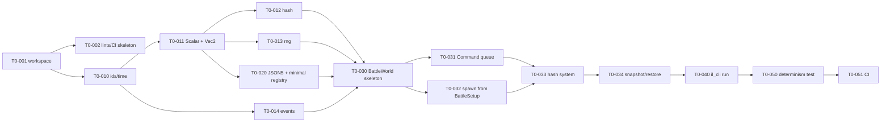
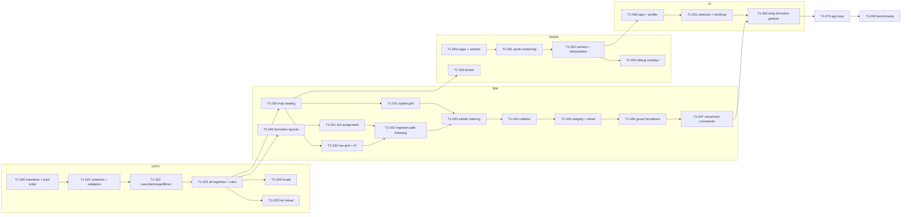

# Iron Legion Engine — Task List, Phases 0 to 2

| | |
|---|---|
| **Version** | 0.1 |
| **Status** | Active |
| **Upstream** | [PRD §30 roadmap](01-prd.md#30-roadmap) · [SAD](02-sad.md) · [Simulation Spec](03-simulation-spec.md) · [TDD](04-tdd.md) |

## How to use this list

- Task IDs are `T<phase>-<nnn>`. Tick the box when the task's **Done when** holds, not when the code compiles.
- **Size** is a rough effort class for a solo developer: **S** under half a day, **M** one to three days, **L** a week or more. Not a schedule.
- **Refs** point at the requirement, rule, or TDD section the task implements. If the docs and the code disagree while you work, fix the docs in the same commit.
- **Depends** lists tasks that must be done first. Tasks with no unmet dependencies can be picked in any order; the suggested order inside each phase is top to bottom.
- Every phase ends with its exit-criteria checklist copied from the PRD. A phase is not done until every box in that checklist is ticked.

Workstreams used below: **WS** workspace and tooling · **CORE** `il_core` · **DATA** `il_data` · **SIM** `il_sim_battle` · **RNDR** `il_render` · **UI** `il_ui` · **APP** `il_app` · **CLI** `il_cli` · **AI** `il_ai` · **AUD** `il_audio` · **TEST** tests and benches · **CONTENT** `game/`.

---

## Phase 0 — Foundations

**Goal.** A headless, deterministic battle simulation that steps an empty-of-behaviour world by Commands, can snapshot and restore, hashes its state every tick, and is proven deterministic in CI. No rendering, no gameplay.

**Exit criteria (PRD).** A scenario of 1,000 idle soldiers steps 10,000 ticks twice with identical hashes; snapshot at tick 5,000 and continue yields identical hashes; the workspace builds with `cargo clippy -D warnings`.

### Dependency sketch

### WS — Workspace and tooling

- [x] **T0-001 Create the Cargo workspace** · S · Refs TDD §1.1, SAD §5.1
  Create `Cargo.toml` with `members = ["crates/*", "game/rules", "tests", "benches"]`, resolver 2, `rust-version = "1.80"`, release profile `codegen-units = 1`, `lto = "thin"`. Create empty library crates `il_core`, `il_data`, `il_ai`, `il_sim_battle`, `il_sim_campaign`, `il_save`, and binary crates `il_cli` and `il_app` (the app can be a stub printing its version). Create `game/rules` as an empty library and `game/mod.json5` with `id: "rome"`, `namespaces: ["rome", "greece", "persia"]`.
  **Done when** `cargo build --workspace` succeeds and `cargo tree -p il_sim_battle` shows no `wgpu`, `winit`, `egui`.

- [x] **T0-002 Lints and dependency rules** · S · Refs TDD §1.1, §18, SAD §5.2
  Add `rust-toolchain.toml`, `rustfmt.toml`, `clippy.toml` with `disallowed-methods` for `std::time::Instant::now`, `std::time::SystemTime::now`, `std::fs::*` in sim crates, and `disallowed-types` for `std::collections::HashMap` iteration helpers where feasible. Add `deny.toml` (`cargo deny`) or a workspace test `tests/dep_rules.rs` that parses each `crates/il_*/Cargo.toml` and fails if a sim crate depends on a forbidden crate or on `game_rules`.
  **Done when** `cargo clippy --workspace -D warnings` passes and the dependency-rule test fails when you temporarily add `wgpu` to `il_sim_battle`.

- [x] **T0-003 Pin Phase 0 dependencies** · S · Refs TDD §1.2
  Add `bevy_ecs`, `serde`, `serde_json`, `json5`, `postcard`, `xxhash-rust`, `thiserror`, `tracing` at the versions in TDD §1.2 (adjust to the latest compatible and record the change in TDD §1.2).
  **Done when** `Cargo.lock` is committed and `cargo build` is warning-free.

### CORE — `il_core`

- [x] **T0-010 Ids, tick, turn** · S · Refs TDD §2.2 `ids.rs`, `time.rs`
  `SoldierId`, `RegimentId`, `ArmyId`, `FactionId`, `PlayerId`, `ProjectileId`, `ProvinceId` as newtypes deriving `Copy, Ord, Hash, Serialize, Deserialize`; `IdAllocator<T>` that never reuses ids and serialises its counter; `Tick`, `Turn`, `TICK_SECONDS`, `TICKS_PER_SECOND`.
  **Done when** unit tests cover allocator monotonicity and serde round trip.

- [x] **T0-011 `Scalar` trait, `f32` impl, `Vec2`, `Angle`** · M · Refs TDD §2.2 `scalar.rs`, `vec.rs`, REQ-TECH-009, REQ-TECH-010
  Implement the trait exactly as in the TDD, including `mul_add` as `a * b + self` (no `fma`), `from_f32_data`, `to_f32_render`. `Vec2<T>` with length, normalise-or-zero, clamp length, rotate, dot, perp. `Angle<T>` normalised to `(−π, π]` with `delta`, `turn_toward`, `to_facing8`. Add `#![deny(clippy::float_arithmetic)]` to every crate except inside `scalar.rs`.
  **Done when** tests cover `to_facing8` boundaries at every multiple of 45°, `turn_toward` never overshoots, and `Vec2::rotate` by `TAU` returns the input bit-exactly.

- [x] **T0-012 `StateHasher` and `Hashable`** · M · Refs TDD §2.2 `hash.rs`, SIM-DET-004
  `StateHasher` over xxh3-64; `Hashable` for all ints, `f32` by bit pattern, `Vec2`, `Angle`, `Option`, `Vec` (length-prefixed), tuples; a `#[derive(Hashable)]` proc macro in `il_core_derive` (or a manual impl helper if you want to avoid a proc-macro crate for now; record the choice in TDD §2).
  **Done when** golden test: hashing a fixed struct produces a hash constant checked into the test, so any hasher change is caught.

- [x] **T0-013 RNG streams and `hash_draw`** · S · Refs TDD §2.2 `rng.rs`, SIM-DET-001, SIM-DET-002
  PCG32 `RngStream::from_seed(seed, StreamId)`, `next_u32`, `unit<T>()`; `StreamId` enum with the nine streams; `hash_draw(seed, tick, entity, index) -> T` in `[0, 1)` via xxh3 of the tuple.
  **Done when** golden sequence test for each stream id and a chi-square test on 1e6 `hash_draw` values passes.

- [x] **T0-014 Event base types** · S · Refs TDD §2.2 `events.rs`, SAD §3 principle 2
  `Event` trait, `EventQueue<E>` with `push`, `drain`, deterministic insertion order.
  **Done when** used by T0-030.

### DATA — `il_data` (minimal)

- [x] **T0-020 JSON5 parsing and a minimal `Registry<UnitType>`** · M · Refs TDD §3.2, §3.3 steps 3–4, REQ-TECH-005
  Implement `ContentId`, `Handle<T>`, `Registry<T>`, `ContentKind`, and `Diagnostic`. Load `content/units/*.json5` from a single root (no manifests, no load order, no overrides yet) into `Registry<UnitType>` with only the fields Phase 0 needs: `id`, `name_key`, `category`, `soldier_radius`, `mass`, `hp`, `speed_walk`, `speed_run`, `speed_march`, `morale_base`, `los_radius`. Unknown fields are accepted and ignored in Phase 0 (schema validation arrives in T1-020).
  **Done when** a malformed file produces a `Diagnostic` with file, line, column, and loading `game/content/units/` gives handles that `Registry::get` resolves.

- [x] **T0-021 Phase 0 content: one unit type** · S · Refs Simulation Spec §15.2, CONTENT
  Add `game/content/units/hastati.json5` with the `rome:hastati` values from Simulation Spec §15.2 (all fields, even those not yet read).
  **Done when** T0-020 loads it.

### SIM — `il_sim_battle`

- [x] **T0-030 `BattleWorld` skeleton with the 18-stage schedule** · M · Refs TDD §4.2, §4.5, SAD §6.2
  `BattleWorld { world, schedule, tick, phase }`; 18 `SystemSet`s chained in SAD §6.2 order, each initially containing a no-op system named after the stage; `Clock`, `Phase`, `Rng`, `Ids`, `Events`, `Regs`, `Rules` resources (rules as an empty struct for now); `step(&[Command]) -> StepOutput`; `set_threads(n)` building the task pool.
  **Done when** `step` on an empty world advances the tick and returns a hash that changes with the tick.

- [x] **T0-031 Command types and Stage 0 application** · M · Refs TDD §4.2 `Command`, `CommandKind`, SIM-CMD-001, SIM-CMD-003, REQ-NET-001
  Define the full `CommandKind` enum from the TDD (all variants, including `TransferControl`), `Command`, `RejectReason`. Stage 0 sorts by `(player, seq)`, rejects commands whose `tick` is not the current tick, rejects commands touching regiments not owned by the player, and applies only `Pause`, `SetSpeed` (no-ops per SIM-DET-008), `Halt`, and `TransferControl` in Phase 0. Unhandled variants return `RejectReason::NotImplemented` so nothing silently disappears.
  **Done when** tests: out-of-order commands are applied in `(player, seq)` order; a stale command is rejected; ownership rejection works.

- [x] **T0-032 `BattleSetup` and soldier spawning** · M · Refs TDD §4.2 `interface`, §4.3 components, SIM-FLOW-019, SIM-CORE-004..006, REQ-PERF-004
  Define `BattleSetup`, `SideSetup`, `RegimentSetup`, `GeneralSetup`, `ReinforcementGroup`, `BattleResult` types. `BattleWorld::new` validates (cap 32,768, unit types exist, one general per side; map validation stubbed until T1-060) and spawns regiment entities with `Regiment`, `Anchor`, `Morale` (value only), `Order::Idle`, and soldier entities with `Soldier`, `Pos`, `PrevPos`, `Vel`, `Facing`, `PrevFacing`, `Body`, `Health`, `FatigueC`, `SlotRef(None)`, `Fsm::Idle`. Soldiers are placed in a plain grid around the anchor (real formations arrive in T1-040). Deployment zones are ignored in Phase 0 (anchor from `RegimentSetup` position field, add a temporary `position` field and remove it in Phase 2).
  **Done when** a setup with two sides of 500 soldiers each spawns 1,000 soldier entities with ascending ids and a setup of 40,000 soldiers is rejected with `SetupError::OverCap`.

- [x] **T0-033 Stage 17: state hash and interpolation buffer swap** · M · Refs SIM-DET-004, TDD §4.5, REQ-SIM-005
  Maintain a `Vec<Entity>` sorted by `SoldierId` and one by `RegimentId` in the `Ids` resource. Stage 17 copies `Pos → PrevPos`, `Facing → PrevFacing`, drains events into `StepOutput`, and hashes exactly the fields listed in SIM-DET-004 in that order.
  **Done when** the hash of a freshly spawned world is stable across process runs (golden test) and changes when any hashed field changes.

- [x] **T0-034 Snapshot and restore** · L · Refs TDD §4.6, SIM-DET-005, REQ-SIM-006
  `Snapshot` struct as in the TDD, postcard-encoded; `BattleWorld::snapshot()` and `BattleWorld::restore(&snapshot, &regs)`. Handles are written as `ContentId` strings and re-resolved on restore. Derived data is rebuilt (nothing derived exists yet, but leave the `rebuild_derived()` hook in place with a comment listing what Phase 1 adds: spatial grid, nav grid, flow fields, paths, ranks).
  **Done when** `hash(restore(snapshot(w))) == hash(w)` and stepping both 1,000 ticks produces identical hash sequences.

### CLI — `il_cli`

- [x] **T0-040 `il_cli run`** · M · Refs REQ-TOOL-001, TDD §17
  `il_cli run <scenario.json5> --ticks N [--hash-every K] [--threads T] [--snapshot-at T] [--restore-from file] [--hash-log file] [--content-root dir]`. The scenario file is a `BattleSetup` in JSON5. Prints `tick,hash` lines at the chosen cadence to stdout or the hash log; `--snapshot-at` writes `snapshot.bin` and continues.
  **Done when** `il_cli run tests/scenarios/idle_1000.json5 --ticks 10000 --hash-every 1000` prints ten hashes.

- [x] **T0-041 Phase 0 scenario file** · S
  `tests/scenarios/idle_1000.json5`: two sides, 500 `rome:hastati` each, seed 42, no map.
  **Done when** T0-040 runs it.

### TEST — tests and CI

- [x] **T0-050 Determinism integration test** · M · Refs REQ-TEST-002, TDD §17
  `tests/determinism.rs`: for every file in `tests/scenarios/`, run 10,000 ticks with 1 thread and with 8 threads and compare per-tick hash vectors; snapshot at tick 5,000, restore in a fresh `BattleWorld`, run to 10,000, and compare the tail. Report the first divergent tick on failure.
  **Done when** the test passes for `idle_1000` and fails if you deliberately hash a `HashMap` iteration order.

- [x] **T0-051 CI workflow** · S · Refs REQ-TEST-002, REQ-TEST-005
  GitHub Actions (or your host of choice): `cargo fmt --check`, `cargo clippy --workspace -D warnings`, `cargo test --workspace`, on Windows. Cache the target directory.
  **Done when** the badge is green on `main`.

- [x] **T0-052 Docs update** · S
  Record in TDD §2 the proc-macro decision from T0-012, in TDD §1.2 the actual pinned versions, and in SAD §12 any new debt. Add the `RegimentSetup.position` temporary field to the PRD open questions if it survives the phase.
  **Done when** the docs match the code.

### Phase 0 exit checklist

- [x] `il_cli run tests/scenarios/idle_1000.json5 --ticks 10000` twice gives identical hash logs.
- [x] Snapshot at tick 5,000 and continue gives the same hashes as the uninterrupted run (T0-050 passes).
- [x] `cargo clippy --workspace -D warnings` is clean and CI is green.
- [x] Every Phase 0 Must requirement is satisfied: REQ-VIS-020, REQ-PLAT-001, REQ-PLAT-003, REQ-TECH-001, 002, 008, 009, 010, REQ-SIM-001, 003..009, 021, REQ-NET-001..003, REQ-TOOL-001, REQ-TEST-002.

Phase 0 completed 2026-09-02: CI run 33666395967 on `main` (commit 2ff247b) is green; every box above is ticked.

---

## Phase 1 — Battlefield prototype

**Goal.** 2,000 soldiers in 10 regiments move, wheel, and reform on a rendered isometric battlefield at 60 FPS, driven by mouse and keyboard through Commands, with all content loaded through the full mod system.

**Exit criteria (PRD).** 2,000 soldiers in 10 regiments move and reform at 60 FPS with sim tick ≤ 10 ms; a mod folder overriding a unit's speed takes effect without code changes; determinism test passes with movement.

### Dependency sketch

### DATA — full content framework

- [x] **T1-020 Mod discovery, manifests, load order** · M · Refs TDD §3.3 steps 1–2, Modding SDK §2, §3, REQ-MOD-004, 005
  `Manifest` struct matching `mod-manifest.schema.json`; `discover(roots)`; `resolve_load_order` with Kahn sort, dependency and `load_after`/`load_before` edges, id tie-break, cycle error naming the cycle; `namespaces` honoured only for `game/`.
  **Done when** tests cover diamond dependencies, a cycle, and a `load_before` that contradicts a dependency.

- [x] **T1-021 Schema validation with diagnostics** · M · Refs TDD §3.3 step 3, REQ-MOD-007, Modding SDK §3.6
  Embed `docs/schemas/*.json` with `include_str!`; validate each parsed file; collect every error as a `Diagnostic` in the `file:line:col field: message (expected ...)` format; never stop at the first error.
  **Done when** a file with three errors reports three diagnostics with correct lines.

- [x] **T1-022 Override, merge, list operations, `$from`, `$delete`** · L · Refs Modding SDK §3.3, §3.4, TDD §3.3 step 3
  Implement the accumulating `Value` map per content kind and the directive semantics exactly as the Modding SDK defines them: default deep merge, `$override: "replace"`, `$delete`, `$append`, `$remove`, `$replace` on lists, `$from` resolved before validation with depth ≤ 8 and cycle detection.
  **Done when** the Modding SDK §4 worked example (`mymod:thracian_peltast` from `rome:velites`) loads from a second mod folder and the result equals the expected merged object in a golden test.

- [x] **T1-023 All registries, `Rules`, handle resolution, content registry hash** · L · Refs TDD §3.2 `Registries`, §3.3 steps 4–6, Simulation Spec §15.1
  Typed structs for `UnitType` (all fields), `FormationTemplate`, `GroupFormationTemplate`, `Faction`, `ZoneType`, `MapDef` (metadata only; geometry in T1-030), `SpriteSet`, and the `Rules` sub-structs `MovementRules`, `FormationRules` (others added in Phase 2 with their systems). Two-pass `resolve` so file order does not matter. `content_registry_hash` and `mod_list_hash`. Missing Must-tier rule fields are diagnostics.
  **Done when** loading `game/` yields every registry populated and the hash is stable across file order and whitespace changes.

- [x] **T1-024 Localisation table** · S · Refs REQ-LOC-001, TDD §3.2 `Locale`, Modding SDK §7
  Load `locale/<lang>.json5`, flatten nested keys, fallback chain to `en`, `Locale::get` and `fmt` with `{name}` placeholders. A `--show-keys` debug flag returns the key instead of the string.
  **Done when** a missing key returns the key itself and logs once.

- [x] **T1-025 Hot reload (dev feature)** · M · Refs REQ-MOD-008, TDD §3.2 `HotReload`, SAD §9.4
  `notify` watcher over mod roots; on change, re-run parse, `$from`, validate, merge for that file's kind, and replace the registry item in place by ContentId keeping its index; emit `ReloadEvent`s. Structural changes (new ids) are queued for the next battle load.
  **Done when** editing `speed_walk` in `hastati.json5` while a battle runs changes regiment speed on the next tick.

- [x] **T1-026 Phase 1 content** · M · CONTENT · Refs Simulation Spec §15.2, Modding SDK §4
  `rome:hastati`, `rome:velites`, `greece:hoplite`, `persia:cavalry` unit files; formation templates `line`, `column`, `square`, `wedge`, `phalanx`, `loose`; group formations `battle_line`, `double_line`, `echelon_left`, `echelon_right`, `refused_left`, `refused_right`; zone types `open`, `road`, `forest`, `marsh`, `rock`, `ford`, `bridge`; `rules/movement.json5`, `rules/formation.json5` with the §15.1 defaults; factions `rome`, `greece`, `persia` (minimal); `locale/en.json5`.
  **Done when** `il_cli validate game/` is clean.

- [x] **T1-027 `il_cli validate`** · S · Refs REQ-TEST-005
  Loads the given mod roots and prints diagnostics, exit code 1 on any.
  **Done when** CI runs it over `game/`.

### SIM — map, spatial, pathfinding, formations, movement

- [x] **T1-030 Map loading: heightmap, zones, rivers, reserved fields** · M · Refs SIM-CORE-001, SIM-MOVE-031..033, REQ-SIM-045, Modding SDK §6.1, TDD §6.2
  `LoadedMap` from `MapDef`: 16-bit raw heightmap sidecar (read by the `il_data` pipeline into `HeightmapRef::samples`) to `Vec<S>`, bilinear `height_at`, zone polygons rasterised to a `u8` grid at `zone_cell` (scanline, even-odd, cell centres; later polygons win; `base_zone` fills the rest), rivers as polylines with width rasterised as capsules into a per-cell river flag (crossings are ford/bridge zone polygons whose type has `crossing: true`), deployment polygons, reinforcement edges, `structures` and `siege_points` parsed and stored inert. `BattleWorld::new` requires `map_id` and validates that the map exists, that every side's deployment zone has a polygon and that placement positions lie on the map; `SNAPSHOT_VERSION = 2`. `il_cli genmap` writes the deterministic 800 × 600 m `rome:test_field` (hill, rock, river with an 8 m bridge and a 30 m ford, forest, marsh, road) committed under `game/`; `idle_1000.json5` moved onto it. Hand-written `tests/maps/tiny/` exercises the samples.
  **Done when** a test map loads and `height_at` and `zone_at` match hand-computed samples.

- [x] **T1-031 Uniform spatial grid** · M · Refs TDD §5, REQ-PATH-009, ADR-013
  `SpatialGrid` with linked-cell buckets, `rebuild` from id-sorted entries, `query_circle` returning ascending ids, `for_each_pair` half-neighbourhood, plus the 16 m anchor grid. Stage 6 rebuild system.
  **Done when** brute-force equivalence tests pass and rebuild of 32k entries is under 0.5 ms in a benchmark.

- [x] **T1-032 Nav grid and A\*** · M · Refs SIM-MOVE-001, SIM-MOVE-002, SIM-MOVE-005, TDD §6.1, REQ-PATH-002
  `NavGrid::from_map` with impassable cells (rock, river outside crossings, walls, closed gates) and integer costs; `AStar` with integer octile heuristic, epoch-based closed set, node-index tie-break; `string_pull`; `Pathfinder` trait; `PathRequests` served `paths_per_tick` per tick in ascending regiment id at Stage 3.
  **Done when** A\* equals Dijkstra cost on random grids; string-pulled paths never cross impassable cells; the same request gives the same path across threads.

- [x] **T1-040 Formation templates and layout functions** · M · Refs SIM-FORM-001..011, TDD §7
  `Slot`, `LayoutFn`, `layout_for`, Line, Column, Square, Wedge, Phalanx, Loose, Custom exactly as the rules state (square per the Phase 1 geometry in SIM-FORM-005); role zones for mixed regiments (data only in Phase 1; mixed spawning is Phase 3). Golden tables live in `tests/golden/layouts.json` (bit-exact; regenerate with `IL_UPDATE_GOLDEN=1 cargo test -p il_tests --test layout_golden`).
  **Done when** golden slot tables for each layout at n ∈ {1, 7, 60, 160, 500} match, front rank centred, no duplicates.

- [x] **T1-041 Slot assignment and resize** · M · Refs SIM-FORM-020..023, TDD §7 `assign_slots`
  Keep-slot pass, greedy nearest via spatial grid, swap passes; resize on count change closing ranks from the rear; `needs_reform` flag and Stage 2 `formation_layout` system, parallel over regiments. Replace the Phase 0 grid placement in spawning with a real Line layout.
  **Done when** `assign_slots` at n = 500 is under 0.5 ms in a benchmark and no two soldiers share a slot.

- [x] **T1-042 Regiment path following and speeds** · M · Refs SIM-MOVE-010..013, SIM-MOVE-020 (regiment part), SIM-MOVE-030, TDD §6.2
  `Order`, `Path` components; anchor movement toward waypoints, wheel at `wheel_rate`, cohesion slowdown, arrival facing; `SpeedMode` (the order's mode); slope factor; corridor Column morph per SIM-MOVE-004 against each waypoint's stored corridor width.
  **Done when** a regiment ordered across a test map arrives within `waypoint_radius`, faces the ordered direction, and a regiment ordered through the 8 m bridge (the narrowest corridor a 4 m nav grid holds) morphs to Column and back.

- [x] **T1-043 Soldier steering** · L · Refs SIM-MOVE-020..025, SIM-CORE-010..011, TDD §6.2 `soldier_steer`
  Soldier FSM (`Idle`, `MoveToSlot` only in Phase 1); seek with arrive damping, separation from the previous tick's grid, obstacle avoidance by sampled rotations, `clamp_length`, facing tracking; Stage 4 `par_iter`; Stage 5 integrate with map clamp.
  **Done when** 2,000 soldiers reforming from Line to Column and back settle to integrity ≥ 0.95 within 15 seconds of sim time, and the determinism test passes at 1 and 8 threads.

- [x] **T1-044 Collision resolution** · M · Refs SIM-MOVE-040..042, TDD §5 `for_each_pair`, §6.2 `collision_resolve`, SAD §8 rule 2
  Pair enumeration per cell row in parallel into per-soldier push buffers, sorted `(i, j)` processing, id-order apply, `collision_iterations` passes, push out of impassable cells.
  **Done when** two regiments marched through each other end with no overlapping pairs after 2 s and the momentum-weighted centre test passes.

- [x] **T1-045 Formation integrity and facing changes** · S · Refs SIM-FORM-024, SIM-FORM-030, REQ-FORM-005, 006
  `formation_integrity` system every `integrity_period_ticks`; `SetFacing` wheel versus about-face rule.
  **Done when** integrity reads 1.0 for a settled regiment and drops during a wheel.

- [x] **T1-046 Group formations and drag width** · M · Refs SIM-FORM-040..042, TDD §7 `arrange_group`
  `arrange_group` for all six group kinds; rank selection to match a requested width within tolerance; lateral ordering to minimise crossing.
  **Done when** a battle line of 5 regiments at width 300 m lands within 10 % of 300 m and regiments do not cross.

- [x] **T1-047 Movement command application** · M · Refs SIM-CMD-002, TDD §4.5 Stage 0
  Stage 0 now applies `Move`, `AttackMove` (as `Move` until Phase 2), `Halt`, `SetFormation`, `SetFacing`, `SetSpeedMode`, `GroupFormation`, `Deploy` (position only). Events for rejections.
  **Done when** each command has a test that checks the resulting `Order`/`FormationState` and the determinism test includes a scripted command stream (T1-081).

- [x] **T1-048 Snapshot: derived data rebuild** · S · Refs SIM-DET-005, TDD §4.6
  `rebuild_derived` reconstructs the spatial and anchor grids, the nav grid, the formation slot tables and `Rank`, and the path request queue from `Path.requested`; paths themselves are stored (a re-requested path from the restored anchor would differ from the one in flight, SIM-DET-005 as amended in T1-047).
  **Done when** the snapshot half of the determinism test passes with movement.

### RNDR — renderer

- [x] **T1-050 Window, wgpu device, surface, frame loop skeleton** · M · Refs REQ-TECH-003, TDD §10
  `winit` window; `wgpu` instance, adapter, device, surface with resize; clear-colour frame; `Renderer` struct.
  **Done when** a window opens, resizes, and closes cleanly on Windows.

- [x] **T1-051 Sprite atlas and instanced sprite pipeline** · L · Refs REQ-RNDR-002, TDD §10.1 instancing, depth
  Atlas loader (PNG plus a JSON5 frame table per `SpriteSet`), 32-byte instance layout, ring of 3 instance buffers, one draw per atlas, depth from projected y, alpha-to-coverage. Placeholder art: one 8-facing sheet per unit category is enough for Phase 1.
  **Done when** 32,768 instances render at over 60 FPS on the target GPU in a synthetic test.

- [x] **T1-052 Isometric camera, snap rotation, interpolation, `RenderSnapshot`** · M · Refs REQ-RNDR-001, 003, 005, TDD §10.1 projection, `build_snapshot`
  Projection with fixed pitch and 4 snap rotations; facing index remap; `Camera` pan, zoom limits, edge scroll input hooks; `build_snapshot(view, alpha, ...)` with frustum culling; position lerp and facing snap.
  **Done when** a regiment walking a circle shows no visual stutter at 20 Hz sim / 60 FPS render and rotating the camera keeps sprite facings consistent.

- [x] **T1-053 Terrain rendering** · M · Refs REQ-RNDR-006, TDD §10.1 terrain
  Heightmap mesh, zone-index raster with a palette from the zone colours (rivers and roads come from the raster; open water where no crossing covers a river cell), slope shading and 2 m contour lines, deployment zone outlines through a new line pipeline; sprites sit on the terrain height; the starting camera frames the regiments.
  **Done when** the test map is recognisable and elevation reads correctly under the isometric projection.

- [x] **T1-054 Debug overlays** · S · Refs REQ-RNDR-008, TDD §10.1 debug
  Line pipeline (shared with the deployment outlines of T1-053); F2..F6 toggle nav grid (impassable and costly cells), slots, paths (with the waypoints whose corridor is narrower than the formation marked), anchors and facings, spatial grid cells; all built from `BattleView` by `il_render::build_debug_lines`.
  **Done when** each toggle draws from `BattleView` without touching the ECS mutably.

### UI — egui, input, gestures

- [x] **T1-060 egui integration and profiler overlay** · M · Refs REQ-TECH-004, REQ-TOOL-003, SAD §9.3
  `egui-wgpu` and `egui-winit`; `tracing` spans per stage collected into a ring buffer; overlay showing per-stage tick time, frame time, entity counts.
  **Done when** the overlay shows the 18 stages with live timings.

- [ ] **T1-061 Input state, bindings file, selection model** · M · Refs REQ-INP-001, 002, 004, 005, TDD §11
  `InputState` from winit events; `content/input/bindings.json5` loaded through `il_data`; `Selection` with click, shift-click, box select, double-click by type, control groups; camera bindings.
  **Done when** the bindings file can rebind box-select to a different modifier without code changes.

- [ ] **T1-062 Orders and the drag-formation gesture** · M · Refs REQ-INP-003, REQ-INP-006, SIM-FORM-042, TDD §11
  Right-click move; right-drag to facing and width producing `GroupFormation` or `Move` + `SetFormation`; formation template hotkeys; halt; run toggle; every intent becomes a `Command` stamped `tick + input_delay` with a per-player `seq`.
  **Done when** a gesture unit test maps drag vectors to facing and width and a manual test moves 10 regiments into a battle line facing the drag direction.

### APP — application shell

- [ ] **T1-070 App state machine and fixed-step accumulator** · M · Refs SAD §6.1, TDD §15, REQ-SIM-031
  `AppState::{MainMenu, Battle}` (menu is a single "custom battle from scenario file" button in Phase 1); accumulator with `max_catchup_ticks`; pause and speed as Commands and as accumulator multipliers; event routing stub; `RenderSnapshot` built after stepping with `alpha`.
  **Done when** pausing records a `Pause` command in the replay-to-be command log and the sim never runs more than 4 ticks in one frame.

### TEST — benchmarks and scenarios

- [ ] **T1-080 Benchmark suite** · M · Refs REQ-TOOL-002, REQ-PERF-005, TDD §17
  `benches/` with criterion benches per stage at 2k, 10k, 20k soldiers using generated setups; a checked-in baseline JSON and a comparison script that fails at +20 %.
  **Done when** `cargo bench` produces per-stage numbers and the Phase 1 stages (2 to 7) sum to under 10 ms at 2k.

- [x] **T1-081 Scripted command-stream scenarios** · S · Refs REQ-TEST-002
  Scenario files may include a `commands` list; `il_cli run` feeds them; add `move_reform_2000.json5` (10 regiments, moves, formation changes, wheels) to the determinism set.
  **Done when** the determinism test covers it at 1 and 8 threads.

- [x] **T1-082 Mod override acceptance test** · S · Refs REQ-MOD-001, Phase 1 exit criterion
  `tests/mods/speed_override/` with a manifest and a `units/hastati.json5` containing only `$override: "merge"` and `speed_walk`; a test loads `game/` plus this mod and asserts the registry value.
  **Done when** the test passes and the same mod folder changes speed in the running app.

- [ ] **T1-083 Docs update** · S
  Update TDD §5 to §7, §10, §11 with any signature changes; resolve OQ-1 (4 snaps) and OQ-7 (json5 crate) in the PRD if confirmed; record measured stage costs in the TDD budget table.

### Phase 1 exit checklist

- [ ] 2,000 soldiers in 10 regiments move, wheel, and reform at 60 FPS with the sim tick at or under 10 ms on the target machine (profiler overlay screenshot saved under `docs/evidence/phase1/`).
- [ ] A mod folder overriding `speed_walk` takes effect with no code change (T1-082).
- [ ] Determinism test passes for `idle_1000` and `move_reform_2000` at 1 and 8 threads, including snapshot/restore.
- [ ] `il_cli validate game/` is clean in CI.
- [ ] Every Phase 1 Must requirement is satisfied: REQ-VIS-002, 003, 004, 021, 023, REQ-PERF-001, 004, REQ-TECH-003, 004, 005, REQ-SIM-020, 022..025, 041, 045, REQ-FORM-001..005, 010, REQ-PATH-002, 003, 005, 006, 009, REQ-AI-002, REQ-RNDR-001, 002, 003, 005, 006, 008, REQ-INP-001..004, 006, REQ-LOC-001, 003, REQ-MOD-001, 004..007, REQ-TOOL-002, 003, REQ-TEST-001, 005.

---

## Phase 2 — Combat systems

**Goal.** 10,000 soldiers fight a battle to a conclusion at 60 FPS: melee, ranged with simulated projectiles, morale and routing, fatigue, generals, fog of war, deployment and pursuit phases, a battle AI opponent, battle UI, and audio events.

**Exit criteria (PRD).** 10,000 soldiers fight to a conclusion at 60 FPS with sim tick ≤ 25 ms; the AI wins against a passive player; scenario tests pass; determinism test passes with all combat systems.

### Dependency sketch

```mermaid
flowchart LR
    T2010[T2-010 combat rules + content] --> T2020[T2-020 targeting]
    T2020 --> T2021[T2-021 melee attack]
    T2021 --> T2022[T2-022 death]
    T2010 --> T2030[T2-030 projectile pool + fire]
    T2030 --> T2031[T2-031 flight + landing]
    T2031 --> T2032[T2-032 cap fallback]
    T2022 --> T2040[T2-040 fatigue]
    T2022 --> T2041[T2-041 morale factors]
    T2041 --> T2042[T2-042 rout/rally/shatter + flow fields]
    T2042 --> T2043[T2-043 generals]
    T2010 --> T2050[T2-050 abilities buff/debuff]
    T2043 --> T2060[T2-060 visibility]
    T2060 --> T2070[T2-070 battle phases]
    T2070 --> T2071[T2-071 BattleResult + scenario launch]
    T2060 --> T2080[T2-080 il_ai framework]
    T2080 --> T2081[T2-081 regiment AI]
    T2081 --> T2082[T2-082 army AI]
    T2071 --> T2090[T2-090 battle UI]
    T2090 --> T2091[T2-091 menus + custom battle]
    T2071 --> T2100[T2-100 audio bus]
    T2082 --> T2110[T2-110 scenario tests]
    T2110 --> T2111[T2-111 10k perf]
```

### SIM — combat

- [ ] **T2-010 Combat, morale, fatigue, general, visibility, battle-flow rules and content** · M · Refs Simulation Spec §15.1, TDD §8.1 `CombatRules`, §8.3 `MoraleRules`, `FatigueRules`, CONTENT
  Add `CombatRules`, `MoraleRules`, `FatigueRules`, `GeneralRules`, `VisibilityRules`, `BattleFlowRules` to `Rules`; write `rules/combat.json5`, `morale.json5`, `fatigue.json5`, `general.json5`, `visibility.json5`, `battle_flow.json5` with the defaults; extend unit content with every combat field from §15.2, including `ranged` blocks and `frontal_arc_deg`.
  **Done when** `il_cli validate game/` is clean and every rule field is read by at least one system by the end of the phase (grep check).

- [ ] **T2-020 Melee targeting and engagement** · M · Refs SIM-CMBT-001..004, TDD §8.1 `melee_target`
  `MeleeState`; staggered retargeting via the grid; `attackers` recount; `Fighting` FSM state; regiment `engaged` flag; `AttackRegiment` and real `AttackMove` orders with pursue re-path and charge distance switch to `run`.
  **Done when** two opposing lines marched into contact produce a stable front with each soldier holding at most `reach + slack` from its target.

- [ ] **T2-021 Melee resolution** · L · Refs SIM-CMBT-010..018, TDD §8.1 `hit_probability`, `melee_damage`, `attack_arc`
  Attack cycles with staggered initial cooldown, hit roll via `hash_draw`, damage and armour, frontal arc classification, flank and rear multipliers, charge window and mass push (with T1-044's `charge_mass_mult`), anti-cavalry bracing, terrain defence and height, second-rank attack, experience multiplier, per-thread `AttackOutcome` buffers merged in attacker id order.
  **Done when** formula unit tests pass and the melee scenario bands in Simulation Spec §15.3 rows 1 to 4 hold over 50 seeds (using T2-110 harness).

- [ ] **T2-022 Death, kill credit, casualty rings, reform trigger** · M · Refs SIM-CORE-008, TDD §8.1 `resolve_deaths`, SIM-FORM-021
  Stage 15: mark `Dead` in id order, remove from regiment soldier lists and grid, update `deaths_5s` ring buffers, credit kills, emit `SoldierDied`, set `needs_reform`; corpse timer is render-only.
  **Done when** regiment counts and the hash stay consistent after 5,000 deaths and the determinism test passes.

- [ ] **T2-030 Projectile pool, ranged targeting, firing** · M · Refs SIM-PROJ-001..004, TDD §8.2, REQ-PERF-008
  `Projectile` component, `ProjectilePool` of pre-spawned entities sized to `projectile_cap`; `Fire` regiment component with `FireMode`; ranged retarget every `ranged_retarget_ticks`; per-soldier reload, volley synchronisation, aim prediction, scatter via `hash_draw`, ammo, direct-fire friendly block check.
  **Done when** 120 velites fire 8 synchronised volleys and ammo reaches 0.

- [ ] **T2-031 Projectile flight and landing** · M · Refs SIM-PROJ-005..007, 009, TDD §8.2 `projectile_advance`, `projectile_land`
  Precomputed `land_tick`, direct and indirect arcs, Stage 11 advance in parallel, landing query, nearest hit with shield and arc rules, `PendingDamage` applied in `(tick, target id)` order, friendly fire.
  **Done when** flight-time golden tests pass and the volley scenario band (Simulation Spec §15.3 row 5) holds.

- [ ] **T2-032 Statistical fallback above the cap** · M · Refs SIM-PROJ-008, REQ-CMBT-015, SAD T-3
  When the pool is exhausted, resolve volleys statistically with the same `hash_draw` slots and delayed damage.
  **Done when** the "statistical vs simulated" band (row 6) holds within 10 % over 50 seeds.

- [ ] **T2-040 Fatigue** · S · Refs SIM-FAT-001..005, TDD §8.3 `fatigue_mults`
  Stage 13 accumulation by activity and terrain, recovery, armour rate, continuous multipliers wired into speed, attack, defence, and interval; regiment mean every 10 ticks.
  **Done when** a regiment that runs for 3 minutes reaches Exhausted and its speed drops by the expected multiplier.

- [ ] **T2-041 Morale value, factors, states** · L · Refs SIM-MOR-001..027, TDD §8.3 `morale_factors`, `morale_state`
  All fourteen factors with the anchor grid queries, one-time shocks via a `MoraleShocks` resource, hysteresis state machine, state multipliers wired into combat and movement.
  **Done when** factor unit tests and the hysteresis table test pass, and a regiment losing 30 % in 10 seconds reaches Broken.

- [ ] **T2-042 Routing, rally, shatter, escape flow fields, contagion, pursuit hits** · M · Refs SIM-MOR-030..034, SIM-FLOW-001..003, REQ-PATH-004
  Dijkstra escape fields per side at battle start; `Routing` FSM state following the field; command rejection for routing regiments; rally conditions; shatter conditions; rout shock to neighbours; pursuit hit multiplier; soldiers leaving the field counted as fled.
  **Done when** a broken regiment flees to its own edge along passable cells, rallies when safe, and shatters on the second rout.

- [ ] **T2-043 Generals and auras** · M · Refs SIM-GEN-001..005, REQ-CMBT-020..023
  `GeneralTag` soldier in the bodyguard regiment, hp multiplier, aura radius and combat bonus, death shock event, fate computation for `BattleResult`.
  **Done when** the general-death scenario band (row 7) holds.

- [ ] **T2-050 Abilities: buff and debuff, status effects, energy** · M · Refs SIM-ABIL-001..007, REQ-ABIL-001..003
  `Ability`, `Effect` (all variants parsed; only `Buff`, `Debuff` executable, others rejected at load with a diagnostic), `Statuses`, `Cooldowns`, `Energy`, stacking rules, `status_mults` wired into formulas, `UseAbility` validation. Content: `rome:testudo` (armour up, speed down), `greece:shield_wall`, `persia:war_cry` (enemy morale per second).
  **Done when** testudo reduces arrow casualties in a scenario and expires on time.

- [ ] **T2-060 Line of sight and fog of war** · M · Refs SIM-VIS-001..006, REQ-SIM-050..053, TDD §8.4
  `Visibility` resource, round-robin per-faction update, heightmap sampling along segments, forest concealment, memory for UI ghosts; targeting, abilities, and ranged obey visibility; `reveal_deployment` setting.
  **Done when** a regiment behind a hill is not targetable and becomes visible when the hill is crested.

- [ ] **T2-070 Battle phases: deployment, battle, pursuit, ended** · M · Refs SIM-FLOW-010..017, REQ-SIM-030..034, 036
  `Phase` transitions at Stage 16; `Deploy`, `ConfirmDeployment` with zone checks and auto-placement; timer; defeat detection; `Withdraw` with `Withdrawing` FSM state; pursuit timer; reinforcement groups spawning in Column at edges; `Surrender`. Remove the Phase 0 temporary `RegimentSetup.position` field.
  **Done when** a scripted battle passes through all four phases and emits `PhaseChanged` events in order.

- [ ] **T2-071 `BattleResult`, scenario files, `il_cli autoresolve`** · M · Refs SIM-FLOW-018, 019, REQ-SIM-061, 063, TDD §9 auto-resolve path
  Compute survivors, fled, killed, experience, ammo, general fate, loot; `BattleWorld::result()`; `il_cli autoresolve <setup.json5>` runs AI versus AI headless and prints the result as JSON.
  **Done when** result totals reconcile with initial counts for every scenario in the test set.

### AI — `il_ai` and battle AI

- [ ] **T2-080 Utility-AI framework** · M · Refs SIM-AI-001..003, TDD §8.5 `il_ai`, REQ-AI-001, 005, 006
  `Consideration`, `Curve` (linear, quadratic, logistic, step), `ActionDef`, `AiActionSet` content kind, `InputProvider`, deterministic `select` with order tie-break, cadence helpers, `AiProfile` content kind. Content: `content/ai/regiment_default.json5`, `army_default.json5`, `profiles/default.json5`.
  **Done when** curve golden tests pass and selection is stable across threads.

- [ ] **T2-081 Regiment AI and deployment** · M · Refs SIM-AI-020..022, TDD §8.5 inputs
  `InputId` enum and `RegimentContext`; actions engage, hold, fall back, use ability, switch formation, fire mode; AI deployment in a battle line; commands emitted for `tick + 1` under the AI player id.
  **Done when** an AI regiment forms Square against approaching cavalry and Phalanx when engaged frontally in scripted tests.

- [ ] **T2-082 Army AI** · L · Refs SIM-AI-010..014, REQ-AI-003
  Stance selection, battle line advance with skirmishers forward then behind, cavalry flank groups and charge trigger, defend on high ground, retreat with cavalry screen, reserves commitment.
  **Done when** the AI army beats a passive player army (Phase 2 exit criterion) in 100 % of 20 seeds and beats a "charge everything straight ahead" scripted opponent in over 60 %.

### UI — battle UI and menus

- [ ] **T2-090 Battle UI** · L · Refs REQ-UI-001, 003, 006, TDD §11 panels
  Regiment cards with strength, morale state, fatigue state, ammo; command card with orders, formations, abilities, fire modes, withdraw; minimap with fog and regiment blocks; clock, speed, pause; casualties; deployment tray with confirm; scalable text at 1080p and 1440p; all strings through `Locale`.
  **Done when** a full battle can be fought with mouse only, and a `--show-keys` run shows no literal strings.

- [ ] **T2-091 Main menu, custom battle setup, settings, result screen** · M · Refs REQ-UI-004, 007, REQ-INP-005
  Map picker from the registry, side and roster builder, seed, weather; settings for bindings, video, audio; battle result screen from `BattleResult`.
  **Done when** a custom battle can be set up and fought without editing files.

### AUD — audio

- [ ] **T2-100 Audio event bus and zoom mixing** · M · Refs REQ-AUD-001, 002, TDD §12
  `kira` engine, `SoundSet` content kind, `EventRouter` consuming `StepOutput.events` with voice rate limits, battle-roar loop gain from engaged count, placeholder samples.
  **Done when** the sim has no audio dependency (dependency-rule test) and a charge is audible at near zoom while far zoom plays only the roar.

### APP — integration

- [ ] **T2-101 Replay recording** · S · Refs REQ-SAVE-005 (early), TDD §14 `Replay`
  Record `BattleSetup` plus the per-tick command stream and per-tick hashes to `replays/<timestamp>.ilrp` during every battle (Phase 3 adds checkpoints and the viewer). `il_cli replay --verify` re-simulates and compares hashes.
  **Done when** a replay of a full AI-versus-AI battle verifies.

### TEST — scenarios and performance

- [ ] **T2-110 Scenario outcome harness** · M · Refs REQ-TEST-004, Simulation Spec §15.3, TDD §17
  `tests/scenarios.rs`: runs each scenario in `tests/scenarios/bands/` for 50 seeds headless, evaluates the band assertions written in the scenario file (winner fraction, casualty ranges, event timing), and prints a table. Nightly in CI.
  **Done when** all seven bands in §15.3 are encoded and pass, or failing bands are turned into tuning tasks with the defaults adjusted and recorded in Simulation Spec §15.

- [ ] **T2-111 10k performance pass** · L · Refs REQ-PERF-002, TDD budget table
  Profile the full 10k battle scenario (`tests/scenarios/perf_10k.json5`); bring every stage within its budget so the tick is under 25 ms; typical fixes: parallelise targeting, reduce grid query allocations, batch morale queries on the anchor grid, cap projectile landing work per tick.
  **Done when** the benchmark baseline is updated and CI's +20 % gate is green at 10k.

- [ ] **T2-112 Determinism coverage** · S · Refs REQ-TEST-002
  Add `full_combat_10k.json5` and the seven band scenarios to the determinism test set; run at 1 and 8 threads with snapshot/restore mid-battle.
  **Done when** they pass.

- [ ] **T2-113 Docs update** · M
  Record tuned defaults in Simulation Spec §15, measured budgets in the TDD table, any new ADR in the SAD, and resolve OQ-6 (deployment fog) and OQ-8 (audio crate) in the PRD.

### Phase 2 exit checklist

- [ ] 10,000 soldiers fight to a conclusion at 60 FPS with the sim tick at or under 25 ms (profiler screenshot under `docs/evidence/phase2/`).
- [ ] The AI wins against a passive player (T2-082).
- [ ] Scenario band tests pass (T2-110).
- [ ] Determinism test passes with all combat systems at 1 and 8 threads, including snapshot/restore (T2-112).
- [ ] A recorded replay verifies (T2-101).
- [ ] Every Phase 2 Must requirement is satisfied: REQ-PERF-002, 008, REQ-SIM-030..032, 035, 040, 060, 061, 063, REQ-FORM-006, REQ-PATH-004, REQ-CMBT-001..005, 007, 010..013, 015, 020..022, REQ-ABIL-001, 002 (buff/debuff), REQ-MOR-001..006, REQ-FAT-001..004, REQ-AI-001, 003, 005, 006, REQ-UI-001, 003, 006, 007, REQ-AUD-001, REQ-NET-008, REQ-SAVE-006.

---

## After Phase 2

Phase 3 (scaling: HPA\*, LOD, render thread, mixed regiments, rivers, map editor, replays with checkpoints, 20k) and Phase 4 (campaign layer, MVP) get their own task list once Phase 2's tuning has settled the rule defaults; the Simulation Spec sections §5.1 (HPA\*), §4.1 role zones, and §14 already contain the rules they will implement.
