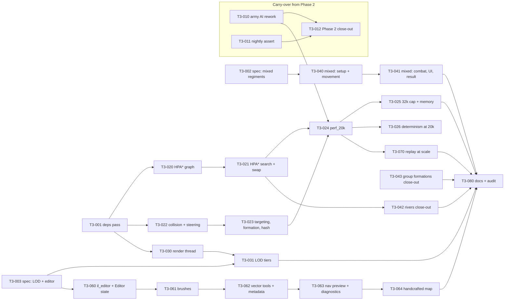
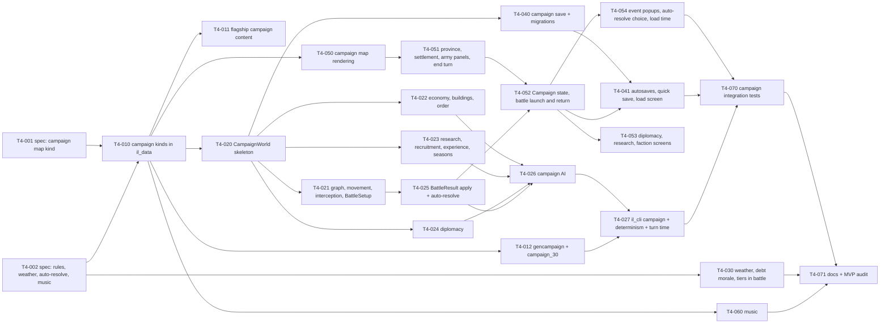

# Iron Legion Engine — Task List, Phases 3 to 4

| | |
|---|---|
| **Version** | 0.1 |
| **Status** | Active |
| **Upstream** | [PRD §30 roadmap](01-prd.md#30-roadmap) · [SAD](02-sad.md) · [Simulation Spec](03-simulation-spec.md) · [TDD](04-tdd.md) · [Modding SDK](06-modding-sdk-spec.md) · [Phases 0–2](07-tasks-phase-0-2.md) |

## How to use this list

- Task IDs are `T<phase>-<nnn>`. Tick the box when the task's **Done when** holds, not when the code compiles.
- **Size** is a rough effort class for a solo developer: **S** under half a day, **M** one to three days, **L** a week or more. Not a schedule.
- **Refs** point at the requirement, rule, or TDD section the task implements. If the docs and the code disagree while you work, fix the docs in the same commit.
- **Depends** lists tasks that must be done first. Tasks with no unmet dependencies can be picked in any order; the suggested order inside each phase is top to bottom (the groups are listed in that order, so the numbering is by workstream, not by sequence).
- **Spec-first tasks** (`T3-002`, `T3-003`, `T4-001`, `T4-002`) write the rule and design text the docs lack today; the implementing tasks depend on them so that every system is still coded from the documents (README reading order 2). A spec task's Done when is that the sections exist, are linked from the traceability matrix, and name their REQ ids.
- Every phase ends with its exit-criteria checklist copied from the PRD. A phase is not done until every box in that checklist is ticked.
- Decisions taken while planning this list (2026-09-07 to 2026-09-10) are given inline as *decision:* notes; they resolve open questions the specs left and are recorded in the owning document by the task that implements them.

Workstreams used below: **WS** workspace and tooling · **CORE** `il_core` · **DATA** `il_data` · **SIM** `il_sim_battle` · **CAMP** `il_sim_campaign` · **RNDR** `il_render` · **UI** `il_ui` · **EDIT** `il_editor` · **APP** `il_app` · **CLI** `il_cli` · **AI** `il_ai` · **AUD** `il_audio` · **SAVE** `il_save` · **TEST** tests and benches · **CONTENT** `game/`.

---

## Phase 3 — Scaling

**Goal.** 20,000 soldiers fight at 30 FPS or better with the sim tick inside one tick period, 32,768 run without a crash, regiments path hierarchically, the renderer runs on its own thread with level-of-detail tiers, regiments may mix unit types, a map made in the in-engine editor plays, and a recorded battle replays to its final hash. Phase 2's open items are closed first.

**Exit criteria (PRD).** 20,000 soldiers at ≥ 30 FPS with sim tick ≤ 50 ms; 32,768 soldiers run without crash; a handcrafted map made in the editor loads in a custom battle; a replay reproduces a recorded battle's final hash.

**Scope decisions.** Render thread (REQ-RNDR-007, Should) and mixed regiments (REQ-FORM-008, Should) are in. The replay viewer with seek (REQ-TOOL-006, Could) and simulation LOD (PRD OQ-4) are deferred: the 20k tick is proven without reduced-rate updates, and `Replay.checkpoints` stays an empty field until a viewer needs it (T3-080 records both in the PRD).

### Dependency sketch

### Carry-over from Phase 2

Phase 2's exit checklist in [07](07-tasks-phase-0-2.md#phase-2-exit-checklist) has three open boxes; they are closed by the tasks below, and 07's "Phase 2 completed" line is written by T3-012.

- [x] **T3-010 Army AI: stand-off, fatigue-aware close, second line** · L · Refs SIM-AI-010, SIM-AI-011, Simulation Spec §15.4, REQ-AI-003, the T2-082 and T2-111 findings in 07
  Rework the attack plan around the two findings. (1) The missile stand-off slot is measured from the nearest *standing enemy line regiment* (infantry or cavalry, not loose skirmishers) so the archers shoot at what matters, and the stand-off phase has a cap (`ai_profile.standoff_max_ticks`, new) after which the line closes whatever the ammo. (2) The close is fatigue-aware: the line marches to `charge_trigger_dist` and only runs the last stretch when its mean fatigue is under `ai_profile.charge_max_fatigue` (new); above it the line walks in and takes the charge shock instead of exhausting itself. (3) When the line's frontage would exceed the map's width between impassable ground, the plan lays a `double_line` (SIM-FORM-042 geometry) with the reserves behind the gaps, so two engine armies on `rome:test_field` close instead of standing forever. Amend SIM-AI-011 and the §15.4 profile table in the same commit; tune with the same lever discipline as T2-082 (each iteration a mod folder, at most six of 20 seeds before widening the levers) and record the run in Simulation Spec §15.3. The morale rules stay as they are (the T2-082 pass showed that lever breaks T2-041).
  **Done when** `ai_vs_passive` holds 20/20 and `ai_vs_charge` more than 12/20 at 20 seeds in release, Simulation Spec §15.3 rows 1 to 8 still hold at 50 seeds, `crates/il_sim_battle/tests/morale.rs` passes unchanged, and a variant of `perf_10k.json5` with both sides the engine's (`autoresolve --ai all`) ends by verdict before its time limit.
  Built 2026-09-10 and ticked the same day on the owner's decision with the passive row at 36/50 (the 20/20 clause stands unmet): `ai_vs_passive` 36/50 in release (72 %; 8/50 at the end of Phase 2), `ai_vs_charge` 41/50 (passes), rows 1 to 8 hold at 50 seeds, `tests/morale.rs` unchanged, `perf_10k.json5` with both sides the engine's ends by verdict (`autoresolve --ai all`, winner side 0). What was built: `AiProfile.standoff_max_ticks` / `charge_max_fatigue`, `ArmyPlan.standoff_since` / `run_in` (`SNAPSHOT_VERSION = 10`), `army::lateral_room` / `lay_line` (the double line), the AI outbox dropped at `Ended`; the line holds its slots until the plan charges and charges together (dressed, or on contact), rests at `approach_distance` 100 until under `charge_max_fatigue` 0.15 for at most `standoff_max_ticks` 2,400, strikes the enemy line's edge on a stable side away from its cavalry with six tenths of that line's frontage, runs the close only under the fatigue threshold and otherwise lets the sim's own charge distance run the last 30 m; missile units measure their stand-off from and aim at the enemy line, javelins wait ahead of the line and screen the charge, spent missile units stay behind, the cavalry marches to a slot beside the line's outer end and charges the struck wing, the bodyguard closes to half the reserve offset so the aura covers the fight, `hold_fire` never in melee; the profile's `charge_trigger_dist` back to 40. The rules in SIM-AI-011/014/021/022 and §15.4, the schema, the SDK and TDD §4.6/§8.5 record all of it; `crates/il_sim_battle/tests/ai_army.rs` gained four tests and `tests/mods/quick_standoff/`. Eight measured iterations on 20 seeds (a throwaway per-200-tick timeline of every regiment found each fault): a hastati regiment marches at 1.2 m/s gaining 0.0036 fatigue a second (its armour adds 0.0016) and runs at 2.5 m/s gaining 0.022, so the old approach arrived at fatigue 0.6 to 1.0 against a defender at 0 and lost its morale to fatigue alone; the strike side flipped every period with the own centroid's jitter and marched the cavalry to death across the enemy front; two regiments stacked on one target; a plain `Move` never fights (`may_fight`), so two advancing lines waiting to dress never charged; spent archers joined the line and ran into the melee; chasing routers at full fatigue routed a winner once, but never chasing let broken regiments rally and return and lost more (measured both ways: 17/20 and 7/20 against 14/20 and 15/20 on 20 seeds). What decides the remaining losses: the defenders' 240 pila per regiment at 25 m and the contact casualty-rate shock (SIM-MOR-010) break the lead regiment in the first twenty seconds in about a quarter of seeds, and the rout spreads through the concentrated line (SIM-MOR-030); the outcomes are bimodal (annihilation either way) and 20-seed counts move by three seeds between equivalent variants. The levers left are the morale and missile rules, the band's army, or a criterion of at least 70 % (rows 9 and 10 read alike then); the owner's call, as after T2-082. The `debug_ai` overlay and docs/08 §4e describe the new behaviour.

- [ ] **T3-011 Nightly rejection assert** · S · Refs REQ-TEST-004, TDD §17 · Depends none
  `tests/tests/scenarios.rs` asserts zero rejected commands only for files whose commands are all scripted, and identical rejection counts per tick across the compared runs for the AI-driven files (the one-tick race T2-112 documented). The nightly of 2026-09-07 failed on the old assert.
  **Done when** the nightly workflow is green on two consecutive nights.
  Built 2026-09-10 (the box waits for the two nights): `SeedOutcome.rejected_by_tick` (ticks with none left out), `FileReport.ai_driven` and `BandReport.rejected_scripted` in `il_cli::bands`, with `ai_driven(&Scenario)` shared by the determinism test; `scenarios.rs` asserts `rejected_scripted == 0`, then runs each AI-driven file a second time under the same options and requires every seed's per-tick rejections, end tick and final hash to match, in the push-time smoke (one seed, 200 ticks) and in the nightly. The nightlies of 2026-09-07 to 2026-09-10 had failed on the old assert with 5 rejected commands over the two AI files (`ai_vs_charge` 1, `ai_vs_passive` 4), and on the passive row itself, which T3-010 left at 36/50 against `min_fraction` 1.0; the owner set the criterion to at least 70 % of 50 seeds the same day (rows 9 and 10 read alike, `ai_vs_charge` also at 50 seeds), recorded in Simulation Spec §15.3, docs/07's exit box and the band files. TDD §17, docs/08 and `nightly.yml` describe the new assert. Local release run of the nightly test on 2026-09-10: 15 pass, 0 fail, `ai_vs_passive` 36/50 and `ai_vs_charge` 41/50, 3 rejected commands (all in the passive file, the same on the second run), 382 s on the target machine.

- [ ] **T3-012 Phase 2 close-out** · S · Depends T3-010, T3-011
  The owner records `docs/evidence/phase2/profiler_10k.png` (`cargo run --release -p il_app -- tests/scenarios/perf_10k.json5 --threads 8`, F12 open during the melee); tick the three open boxes of 07's Phase 2 exit checklist with their measurements, tick T2-082 with a pointer to T3-010, mark REQ-AI-003 met in the audit paragraph, and add the "Phase 2 completed" line with the CI run id.
  **Done when** every box in 07's Phase 2 exit checklist is ticked and CI is green on that commit.

### WS — workspace, dependencies, specs

- [x] **T3-001 Dependency and toolchain pass** · M · Refs SAD §12 T-1, T-11, TDD §1.2 · Depends none
  Phase boundaries are when pins move. Bump `bevy_ecs`/`bevy_tasks`, `wgpu`, `winit`, `egui` (+ `egui-wgpu`, `egui-winit`), `kira`, `jsonschema`, `notify` and the toolchain in `rust-toolchain.toml` to the newest mutually compatible set; drop the unused `tracing` from `il_sim_battle`; fix whatever the new clippy flags. Re-record `benches/baseline.json` on the target machine the same day (`--record-baseline`, `docs/evidence/phase3/machine.md` with the delta). The hash goldens (`tests/golden/`, the `il_cli run` logs CI compares) must stay identical; if a dependency changes floating-point results anywhere the sim can see, the task stops and records why in TDD §1.2 before re-baselining.
  **Done when** CI is green with the new pins, TDD §1.2 lists them with the date, and `il_cli run` of `idle_1000`, `move_reform_2000` and `perf_10k` prints the same hashes as before the bump.
  Done 2026-09-10: the newest *stable* mutually compatible set was a small move (egui / egui-wgpu / egui-winit 0.36.2, glam 0.33.7, jsonschema 0.56, toolchain 1.98.1, `cargo update` of 35 transitive crates); bevy_ecs, wgpu, kira, png and criterion were already newest; winit 0.31 (beta) and notify 9 (rc) skipped as prereleases (owner's decision). `tracing` dropped from il_sim_battle (SAD T-11). Clippy on 1.98.1 flagged nothing. The three `il_cli run` hash logs (CI shapes) were byte-identical before and after the bump. Baseline re-recorded for every key (`docs/evidence/phase3/machine.md`: 2k 3.65 ms, 10k 11.64, 20k 22.32, perf_10k 12.84 mean). The pinned toolchain in both workflows moved with it; CI's green run is the push after this batch.

- [x] **T3-002 Spec: mixed regiments** · S · Refs REQ-FORM-008, SIM-FORM-011, SIM-MOVE-011, TDD §4.2, §4.3, Modding SDK §4.13 · Depends none
  Write the rules the composition needs. *Decision:* `RegimentSetup.units: [{ unit_type, count, experience? }]` is the composition, and the existing `unit_type` + `count` pair stays as the single-entry shorthand (a file gives one or the other). New rules under §4.1 (SIM-FORM-012..015): a regiment's categories are laid out by the template's `role_zones` (a template without zones lays the units out in list order front to back); the regiment's speed is the slowest category's (SIM-MOVE-011 already says so), its `cost` for AI strength inputs is the sum, its allowed `formations` the intersection of its units' lists (the first unit's list when the intersection is empty, with a load-time warning), its abilities the first unit's plus its general's; soldiers keep their own unit for reach, ranged, armour, mass and sprites; `Fire` exists when any unit has `ranged`. Result: `RegimentResult.units: [{ unit_type, initial, survivors, killed, fled }]` alongside the totals. Campaign regiments stay single-unit in Phase 4. Extend TDD §4.2/§4.3, SDK §4.13 and the scenario schema; note the snapshot version bump T3-040 will make.
  **Done when** the sections exist, `RegimentSetup.units` validates in the scenario schema, and the traceability matrix row for FORM points at them.
  Done 2026-09-10: SIM-FORM-012..015 in Simulation Spec §4.1 (composition as an ordered list of unit groups, the shorthand as the single-group form, both forms together rejected; layout by role zones or list order; cost, category, formations, abilities and `Fire` derived; one result row per group). *Decision (owner):* a unit type may repeat in `units`, each entry staying its own group with its own experience and result row (so T3-040 adds `Soldier.group: u8`). There was no scenario schema at all (scenario files were serde-only), so `docs/schemas/scenario.schema.json` now describes the whole file (band block included) and `tests/tests/content.rs` validates every file under `tests/scenarios/` against it on every push through the new `il_data::schema::validate_free`; `parse_scenario` stays serde until T3-040. TDD §4.2 (`UnitGroupSetup`, `UnitGroupResult`, the setup errors), §4.3 (`Regiment.units`, `Soldier.group`, the snapshot bump T3-040 makes), §7 (`layout_slots` with category counts), §17; SDK §4.13; README matrix FORM row.

- [ ] **T3-003 Spec: LOD tiers, the render thread flag, the Editor state** · S · Refs REQ-RNDR-004, REQ-RNDR-007, REQ-TOOL-004, TDD §10.1, §15, §16, SAD §5.2, §6.1, §8 · Depends none
  LOD: *decision:* the tier thresholds `z1`, `z2` (camera pixels per metre) live in the Video settings with il_render defaults (`DETAIL_Z1 = 24`, `DETAIL_Z2 = 8` as starting values); write the tier table in TDD §10.1 (Detailed below `z1`: full frame and animation; Reduced between: one frame per state, no animation; Aggregation above `z2`: one quad per rank block from `FormationState`, faction-tinted, density-shaded), the snapshot fields it adds, the projectile and corpse culling rule at far zoom (REQ-RNDR-009, a Phase 2 Should never audited), and the `--single-thread-render` flag of T3-030. Editor: `AppState::Editor(Box<EditorSession>)` in TDD §15, the `il_editor` crate's dependency rules in SAD §5.2 (may depend on `il_core`, `il_data`, `il_sim_battle` for `NavGrid` and `LoadedMap`, `il_render`, `il_ui`; never on `il_app`; it is a presentation crate that may write files) with the graph's dotted edges made solid, and the `dep_rules.rs` row. Sim LOD (OQ-4) recorded as not needed unless T3-024 misses.
  **Done when** the sections exist and `dep_rules.rs` lists `il_editor` (the crate itself arrives in T3-060).

### SIM — pathfinding and the 20k tick

- [ ] **T3-020 HPA\* graph** · M · Refs SIM-MOVE-003, TDD §6.1 `HpaGraph`, REQ-PATH-001 · Depends T3-001
  `HpaGraph::build(nav, cluster)`: clusters of `movement.hpa_cluster` cells (16 cells = 64 m on the 4 m grid; `rome:test_field` gives 13 × 10), gates as maximal passable runs along cluster borders with one node at the run's centre plus its ends when the run exceeds `hpa_gate_split`, inter-cluster edges between paired gate nodes at the straight step cost, intra-cluster edges from an A\* between every gate pair of a cluster computed at build (the `refine` searcher, bounded to the cluster), `cluster_of` per cell. `repair(dirty)` is declared and stubbed with a `todo!`-free "rebuild the touched clusters" implementation (Phase 5 gates call it). Built by `BattleWorld::new` and `rebuild_derived` (derived data, never hashed).
  **Done when** golden tests pin the gate count and positions on `tests/maps/tiny/` and `rome:test_field`, every intra-cluster edge cost equals the Dijkstra oracle, and a build of the 1600 × 1200 m map of T3-024 takes under 50 ms in a benchmark.

- [ ] **T3-021 HPA\* search, refinement, `Pathfinder` swap** · M · Refs SIM-MOVE-002, TDD §6.1 `Hpa`, REQ-PATH-001, REQ-PATH-002 · Depends T3-020
  `Hpa::find`: insert the start and goal as temporary nodes linked to their cluster's gates (costs from a bounded A\*), search the abstract graph with the same integer octile heuristic and node-index tie-break, refine each abstract segment with A\* restricted to the two clusters it joins, then `string_pull`. `PathfinderRes` becomes `Hpa`; `AStar` stays for tests, the refine step and the oracle. `paths_per_tick` and `PathRequests` are unchanged. Paths change by design, so the determinism goldens (`tests/golden/`, the CI hash logs) are re-baselined once with a note in the commit.
  **Done when** the HPA\* path cost is within 10 % of the A\* cost on 1,000 random grids (TDD §6.1 test list), the same request gives the same path on 1 and 8 threads, no path crosses an impassable cell, `move_reform_2000` still arrives and morphs at the bridge (T1-042's test), and Stage 3's mean at 20k is inside its 1 ms budget with 200 regiments re-pathing.

- [ ] **T3-022 Collision and steering pass** · L · Refs SAD §12 T-10, SIM-MOVE-022, SIM-MOVE-040..042, TDD §6.2 budgets · Depends T3-001
  The two Phase 1 giants: at 20k Collision is 12.1 ms and Steering 7.8 ms against 8 ms budgets. Candidates from T-10, all semantics-preserving: a narrower pair neighbourhood (only cells within `2 r_max` of a soldier's cell), skipping a collision pass when no push moved anyone in the previous pass, per-row pair buffers reused across ticks, steering neighbours gathered once per cell row instead of per soldier, and the `sep_max_neighbours` selection without a per-soldier sort. Every change must keep the `il_cli run` hash logs of `idle_1000`, `move_reform_2000`, `perf_10k` and `ai_skirmish_300` identical (the T2-111 guard); a change that alters results is a rule change and goes through the Simulation Spec with its own re-baseline note.
  **Done when** `il_cli bench --soldiers 20000` on the target machine shows Collision ≤ 8 ms and SoldierSteering ≤ 8 ms mean with the hash logs unchanged, and the baseline is re-recorded.

- [ ] **T3-023 Targeting, formation and hash at 20k** · M · Refs SAD §12 T-4, T-10, TDD §8.1 `melee_target`, §4.5 Stage 17 · Depends T3-022
  Targeting pays its per-soldier pass whether or not anyone fights (3.0 ms at 20k with no enemy in sight): iterate the gated regiments' soldier lists only, and skip regiments with no enemy inside `engage_radius` of their extent. Formation Stage 2 (p95 2.2 ms at 10k when many regiments reform at once) spreads reforms over ticks only if the spec allows it, else keeps its cost. Measure the hash (T-4) at 20k and 32k and, if it exceeds 3 ms, hash fewer derived fields rather than fewer ticks (the per-tick hash is what replays and lockstep compare). Same hash-log guard as T3-022.
  **Done when** every stage's mean at 20k sits inside its budget in the TDD table (Targeting 4, Formation 2, EventsAndHash 3) with the hash logs unchanged.

- [ ] **T3-024 `perf_20k.json5` and the 20k fight bench** · M · Refs REQ-PERF-003, REQ-PERF-005, REQ-TEST-003, TDD §17 · Depends T3-010, T3-021, T3-023
  `il_cli genmap` gains `--size W H` and `--preset plains` (flat with gentle rises, no river) and writes `rome:wide_field`, 1600 × 1200 m, committed under `game/`; `tests/scenarios/perf_20k.json5`: 10,000 a side in 50 regiments of 200 plus bodyguards, both sides the engine's (T3-010's second line lets them close), a 6,000-tick time limit. Bench key `perf_20k` in `benches/baseline.json`; CI runs the comparison warn-only after the `perf_10k` line; `docs/evidence/phase3/bench_perf_20k.md` with the per-stage table before and after the pass.
  **Done when** `il_cli bench --scenario tests/scenarios/perf_20k.json5 --threads 8` in release on the target machine reports a tick mean ≤ 50 ms with the p95 recorded, and the app runs the file at ≥ 30 FPS (screenshot `profiler_20k.png`; below 60 FPS the render thread of T3-030 is the next lever, not a blocker here).

- [ ] **T3-025 32,768 cap run and memory budget** · S · Refs REQ-PERF-004, REQ-PERF-007, SIM-CORE-006 · Depends T3-024
  `tests/scenarios/cap_32768.json5` on `rome:wide_field` fills the cap exactly (the generals counted) and fights; one more regiment as a reinforcement group proves `ReinforcementsDropped`. `il_cli bench --memory` prints the process peak working set at the end of the run (a process-memory crate such as `sysinfo`, il_cli only, pinned in TDD §1.2). The number goes into `docs/evidence/phase3/memory_32k.md` with the machine.
  **Done when** the file runs 3,000 ticks headless and in the app without a crash or a panic, the dropped group is reported, and the peak is under 4 GB.

- [ ] **T3-026 Determinism coverage at 20k** · S · Refs REQ-TEST-002, TDD §17 · Depends T3-024
  `perf_20k.json5` joins the determinism corpus with a short in-process budget (`determinism: { ticks: 400, snapshot_at: 200 }`) and CI's release double-run (1,000 ticks every 100), as `perf_10k` did in T2-112.
  **Done when** it passes at 1 and 8 threads with the mid-battle restore, in the debug test and in CI.

### RNDR — render thread and LOD

- [ ] **T3-030 Render thread** · L · Refs REQ-RNDR-007, SAD §8, §12 T-5, TDD §10.1 Threading, §15 · Depends T3-001, T3-003
  The winit loop, the sim step and egui's tessellation stay on the main thread; `Renderer` moves to a render thread that owns the wgpu device, surface, instance buffers and present. Per frame the main thread sends one owned `FrameJob { RenderSnapshot, SpriteScene, LineScene, UiOutput (tessellated), camera, screen, resize }` over a bounded channel of one slot that replaces a stale unrendered job rather than blocking; the render thread builds instances and presents; resize and vsync changes travel in the job. The profiler shows both threads (frame build on main, GPU submit on render) and the accumulator never waits on the GPU. `--single-thread-render` keeps the Phase 2 path for debugging and for machines where the surface must stay on the main thread. `il_app --bench-sprites` runs through the thread.
  **Done when** the 10k fight (`perf_10k.json5`, 8 sim threads) holds 60 FPS in release on the target machine with the sim tick unchanged (`profiler_10k_threaded.png` under `docs/evidence/phase3/`), the frame-time check of T1-051 still passes, and toggling the flag changes nothing but the profiler rows.

- [ ] **T3-031 LOD tiers and far-zoom culling** · L · Refs REQ-RNDR-004, REQ-RNDR-009, TDD §10.1 LOD (T3-003), REQ-UI-006 · Depends T3-003, T3-030
  `build_snapshot` selects the tier from `camera.zoom` against the settings' `z1`/`z2`: Detailed as today; Reduced writes one frame per soldier state and skips the animation column; Aggregation writes no soldier instances but one `BlockInst { anchor, facing, ranks, files, count, side }` per regiment rank block from `FormationState` (routing and withdrawing soldiers still draw as Reduced sprites so a rout stays visible), rendered as tinted quads through the sprite pipeline's atlas of block frames. Projectiles and corpses are culled above `z2` and corpses thinned to every fourth above `z1`. The Video tab gains the two thresholds (decision: settings with engine defaults); the profiler shows the active tier. A headless frame test runs when a software adapter exists (`wgpu` fallback adapter); otherwise the tier selection and block generation are unit-tested from `BattleView`.
  **Done when** the 20k fight runs at ≥ 30 FPS at every zoom from `MIN_ZOOM` to `MAX_ZOOM` on the target machine (and ≥ 60 at strategic zoom), tier boundaries are covered by unit tests, and `tests/snapshot.rs` pins the block count for a known regiment.

### SIM — mixed regiments and close-outs

- [ ] **T3-040 Mixed regiments: setup, spawn, layout, movement** · M · Refs T3-002 (SIM-FORM-012..015), SIM-FORM-011, SIM-MOVE-011, TDD §4.2, §4.3, §7 · Depends T3-002
  `RegimentSetup.units` validated (every unit exists, counts ≥ 1, the categories fit the template's `role_zones`), the shorthand mapped onto it; `Regiment.units: Vec<Handle<UnitType>>` with `Soldier.unit` per soldier (already there); `layout_for` and `assign_slots` honour role zones (SIM-FORM-011: zone slots only to that category, overflow to the nearest rank of any zone); regiment speed from the slowest category; `formation_width` from the widest category's `soldier_radius`; the builder's `BuilderState` rows accept a composition. Snapshot version bump (`RegimentSnap.units`, `SoldierSnap.unit` already stored); goldens re-baselined with a note. Content: `rome:cohort_mixed` scenario `tests/scenarios/mixed_cohort.json5` (100 hastati behind 40 velites) in the determinism corpus.
  **Done when** the scenario spawns the velites in the front zone and the hastati behind, moves at the hastati's speed, reforms after deaths with the zones kept, and the determinism test passes at 1 and 8 threads with a restore.

- [ ] **T3-041 Mixed regiments: combat, cards, AI inputs, result** · M · Refs T3-002, SIM-CMBT-002, SIM-PROJ-001, TDD §8.1, §8.2, §8.5, §11, SIM-FLOW-018 · Depends T3-040
  Melee reach, armour, mass and hit rolls already read the soldier's unit; `Fire` exists when any unit has `ranged` and only ranged soldiers volley; abilities per SIM-FORM-014; the AI's `RegimentContext` category and cost inputs use the composition (category by the largest cost share); the regiment card and the command card show the composition ("hastati 100 · velites 40") and the mean volleys of the ranged part; `RegimentResult.units` filled and reconciled in `tests/tests/result.rs`; the result screen lists the parts. Band: the mixed cohort against 120 hoplites frontal in `tests/scenarios/bands/melee_mixed_cohort.json5` with the velites' javelins thrown first.
  **Done when** the mixed regiment throws, fights, reports per-unit counts that sum to the totals for every scenario in the result test, the custom battle builder can compose and start one, and the band holds its stated clause over 50 seeds.

- [ ] **T3-042 Rivers, fords and bridges close-out** · S · Refs REQ-SIM-042, SIM-MOVE-004, SIM-MOVE-032, SIM-CMBT-016 · Depends T3-021
  Everything is built (T1-030, T1-042, T2-010); what is missing is the proof. A test on `rome:test_field` asserts a regiment in the ford moves at `move_mult` 0.5 and defends at `ford_defence_mult` 0.7 (hit probability against soldiers standing in the ford), the bridge corridor morph to Column and back with HPA\* paths, and that a river cell without a crossing is impassable to steering and to collision push-out. The Phase 3 audit line cites it.
  **Done when** the test passes on 1 and 8 threads.

- [ ] **T3-043 Group formations close-out** · S · Refs REQ-FORM-009, SIM-FORM-040..042, TDD §7 `arrange_group`, §11 · Depends none
  Player and AI use exist (T1-046, T1-062, T2-090's presets, T2-081/082). One test drives every group kind with five regiments through the player's `GroupFormation` command and through the AI's deployment preset, and asserts the SIM-FORM-042 geometry (gaps, echelon steps, refused flank angle) and no crossing. The audit line cites it.
  **Done when** the test passes.

### EDIT — map editor

- [ ] **T3-060 `il_editor` crate, Editor state, map document, open and save** · M · Refs REQ-TOOL-004, REQ-MOD-009, TDD §16, Modding SDK §6.1, SAD §5.1, §6.1, T3-003 · Depends T3-003
  New crate `crates/il_editor` (dependency rules per T3-003, `dep_rules.rs` enforces them). `MapDocument { def: MapDef, heights: Vec<f32>, dirty }` loaded from a registry map or a new blank map (`size`, `height_cell`, `base_zone`); `EditorSession` in il_app behind `AppState::Editor`, entered from a main-menu Editor button (map picker or New), with the battle camera and terrain renderer showing the document live (`TerrainMesh::build` re-run on a debounced edit). Save writes `content/maps/<id>.json5` and `assets/maps/<id>.hgt` into a target mod folder chosen in a folder picker (never `game/` unless chosen), exactly as `il_cli genmap` writes them; a save into a loaded mod triggers the hot reload path. Undo/redo over a document history of 64 steps.
  **Done when** opening `rome:test_field`, saving it into `tests/mods/editor_out/` and running `il_cli validate` on that mod reports no diagnostics, and the saved files are byte-identical to the originals.

- [ ] **T3-061 Height and zone brushes** · M · Refs TDD §16, Modding SDK §6.1 · Depends T3-060
  Height brush (raise, lower, smooth, flatten to the clicked height; radius and strength in a tool panel; falloff curve) painting the sample grid; zone brush painting a working raster that the save turns into polygons (marching squares on the raster, then simplified; later polygons override earlier ones per SIM-MOVE-031) with the type picked from the loaded `ZoneType`s (`rock`, `forest`, `marsh`, `road` and any mod types). The terrain view and the nav preview of T3-063 follow within a frame.
  **Done when** a painted hill and a painted forest reload with the same `height_at` and `zone_at` samples (a golden round trip in the crate's tests), and the brush stays under 2 ms per stroke frame on the 1600 × 1200 map.

- [ ] **T3-062 River, road, polygon, deployment and edge tools; metadata; structures** · M · Refs TDD §16, Modding SDK §6.1, SIM-MOVE-032, SIM-FLOW-016 · Depends T3-061
  Polyline tool for `rivers[]` (width per river) and `road` zone strips (a polyline with width rasterised to a road polygon); polygon tool for ford and bridge zones (any `crossing: true` type) and for arbitrary zone polygons; deployment tool: one polygon per side plus the reinforcement edges per side; a metadata panel for `id`, `name_key`, `size`, `campaign_terrain_tags`, `weather_allowed`, `base_zone`; a structures tool that places `structures[]` and `siege_points[]` records (kind, at or polyline) inert until Phase 5. Vertex drag and delete on every polygon.
  **Done when** a map with a river, an 8 m bridge, a ford, a road, two deployment zones and one reinforcement edge made only in the editor passes validation and a custom battle on it crosses the bridge in Column.

- [ ] **T3-063 Live nav-grid preview and diagnostics** · S · Refs TDD §16, SIM-MOVE-001 · Depends T3-062
  `NavGrid::from_map` on the document (debounced, on a worker thread of the editor) drawn as the `F5` overlay (impassable and costly cells, corridor widths under 12 m marked); the `il_data` validation of the document's merged value shown in a diagnostics panel (a polygon with fewer than three vertices, a zone type that does not exist, a deployment side without a polygon, a reinforcement edge that touches no deployment zone).
  **Done when** painting rock across the bridge shows the corridor closing in the overlay within a frame and a bad map shows its diagnostic with the field name before Save is allowed.

- [ ] **T3-064 A handcrafted map** · S · CONTENT · Refs Phase 3 exit criterion, SIM-CAMP-013 · Depends T3-063
  The owner makes a map in the editor (a river valley with a bridge, a ford, a forested ridge and a road; 1200 × 900 m suggested), tagged `campaign_terrain_tags: ["river"]` so Phase 4's map selection can use it, and commits it under `game/content/maps/` with its `.hgt`. `docs/08` gains the editor walkthrough that produces it.
  **Done when** the map appears in the custom battle map picker, a battle on it is fought to a result, and `il_cli validate game/` is clean.

### TEST — replay proof

- [ ] **T3-070 Replay at scale** · S · Refs REQ-SAVE-005, TDD §14, Phase 3 exit criterion · Depends T3-024
  The recorder and verifier exist (T2-101). The nightly records `perf_20k.json5` with `autoresolve --record-replay` to its end, verifies it on eight threads, and compares the recorded final hash with a second `il_cli run` of the same file to the same tick; `il_app --replay` of that file is the docs/08 check (`replay OK` at the end). `Replay.checkpoints` stays empty (the viewer is deferred; T3-080 records it).
  **Done when** the nightly line is green and the manual check is recorded in docs/08.

### Docs

- [ ] **T3-080 Docs update and Phase 3 exit audit** · M · Depends T3-012, T3-025, T3-026, T3-031, T3-041, T3-042, T3-043, T3-064, T3-070
  TDD: §1.2 pins, the budget table's 20k and 32k columns as measured, §6.1 HPA\* as built, §10.1 LOD and threading as built, §15 the Editor state and flags, §16 the editor as built, §17 the new tests and nightly lines; SAD: §8 the render thread, §12 T-5 and T-10 closed with numbers, T-11 (`tracing`) closed, new debt named; Modding SDK §6.1 as built; Simulation Spec §15.3 the new bands and §15.4 the new profile fields; docs/08: editor, `--single-thread-render`, the detail setting, the 20k and 32k runs, the replay check; PRD: OQ-4 resolved (not needed at 20k, or what was done), REQ-TOOL-006 marked deferred with the reason, §30 state paragraph; `docs/evidence/phase3/` complete. The Must audit under the exit checklist, as 07 does it.
  **Done when** every TDD, SAD, Simulation Spec, SDK, docs/08 and PRD statement about Phase 3 code matches the code.

### Phase 3 exit checklist

- [ ] 20,000 soldiers fight at ≥ 30 FPS with the sim tick at or under 50 ms on the target machine (T3-024: `bench_perf_20k.md`, `profiler_20k.png` under `docs/evidence/phase3/`).
- [ ] 32,768 soldiers run without a crash and under 4 GB (T3-025: `memory_32k.md`).
- [ ] A handcrafted map made in the editor loads in a custom battle (T3-064).
- [ ] A replay reproduces a recorded battle's final hash at 20k (T3-070, nightly).
- [ ] Phase 2's open boxes are closed (T3-012).
- [ ] Every Phase 3 Must requirement is satisfied: REQ-PATH-001 (T3-020/021), REQ-RNDR-004 (T3-031); and the Phase 2 Must carried over, REQ-AI-003 (T3-010). Should requirements delivered: REQ-PERF-003 (T3-024), REQ-PERF-007 (T3-025), REQ-SIM-042 (T3-042), REQ-FORM-008 (T3-040/041), REQ-FORM-009 (T3-043), REQ-RNDR-007 (T3-030), REQ-AUD-002 (T2-100), REQ-MOD-009's editor half and REQ-TOOL-004 (T3-060..064), REQ-SAVE-005 (T2-101, T3-070). Deferred: REQ-TOOL-006 (Could).

---

## Phase 4 — Campaign layer

**Goal.** A turn-based campaign on a province map: economy, buildings, research, recruitment, replenishment and experience, diplomacy, seasons, a campaign AI, a campaign UI, battles launched from interceptions and fought in the battle layer or auto-resolved, campaign saves with migration and autosaves, weather in battles, and music. **This completes MVP.**

**Exit criteria (PRD).** A 30-faction campaign runs 100 turns with AI only in under 5 s per turn; a player campaign can be saved mid-battle, loaded, and continued with identical hashes; battles launched from the campaign apply results correctly.

**Scope decisions.** Every Should of the phase is in (trade routes, experience and replenishment, seasons with winter attrition, music, auto-resolve, the turn-time and load-time budgets) plus the spec-only public order and rebellions (SIM-CAMP-023) and the Could weather (REQ-SIM-046). Auto-resolve (PRD OQ-3) *decision:* a deterministic statistical resolver is the campaign's default and the only path for battles between AI factions; the player may choose "simulate" (a headless AI-versus-AI battle at full speed) or "fight" for battles involving their faction; the two producers are held together by a band (T4-025). The campaign map *decision:* a new content kind `content/campaign/` with a hand-written flagship map of 16 to 24 provinces and a generator for the 30-faction test (T4-001, T4-011, T4-012); rendered as flat owner-tinted polygons with sprites (T4-050). Campaign regiments stay single-unit.

### Dependency sketch

### Spec-first

- [ ] **T4-001 Spec: campaign map content kind and start state** · M · Refs REQ-CAMP-010, SIM-CAMP-010, TDD §3.2, §9 `CampaignStart`, Modding SDK §2.1, §4.3, Glossary · Depends none
  Write Modding SDK §4.15 "Campaign maps — `content/campaign/`" and `docs/schemas/campaign-map.schema.json`: `{ id, name_key, size: { w, h }, provinces: [{ id (a string unique within the map), name_key, polygon, terrain (a tag that battle maps carry in campaign_terrain_tags), resources: [{ kind, value }], settlement: { tier: 1..3, name_key }, population, neighbours: [{ province, cost, kind: land | river_crossing | mountain_pass | sea }] }], start: { turn, year, rebels: faction id, factions: [{ faction, provinces: [ids], treasury, armies: [{ province, general: unit id, regiments: [{ unit_type, count, experience }] }] }] } }`. Validation: neighbour edges symmetric, every start province exists and is owned once, every terrain tag has at least one battle map with that tag among the loaded maps and none with a `settlement_tier_*` tag is required in Phase 4 (assaults are field battles until Phase 5), every faction's general unit is of category `general`. *Decision:* the map's `start` block is authoritative; `Faction.starting_provinces` is read only for a faction the block omits (SDK §4.3 note). *Decision (I2):* `Faction.tech_tree` names a tree tag that technologies carry in `tree`; at least one technology per named tree. Add `Registries.campaign_maps`, `CampaignStart` (a chosen map plus the player's faction and the seed) to TDD §3.2/§9, a Glossary row for *Campaign map*, and the folder to SDK §2.1.
  **Done when** the sections and the schema exist, the schema validates a worked example in the SDK, and the traceability matrix CAMP row points at them.

- [ ] **T4-002 Spec: campaign, diplomacy and weather rules; experience mapping; auto-resolve model; music** · M · Refs SIM-CAMP-003, 011, 012, 020..023, 031, 040..045, SIM-FLOW-018, SIM-VIS-001, SIM-PROJ-004, SIM-FAT-001, REQ-SIM-046, REQ-SIM-064, REQ-AUD-004, PRD OQ-3, OQ-5, TDD §12, Modding SDK §2.1 · Depends none
  Simulation Spec §15.1 gains three tables with every tunable named by §14 and a default: **`campaign.json5`** (`turns_per_year`, `winter_attrition`, `base_movement`, `no_road_mult`, `reinforce_delay_ticks`, `tax_rate[]`, `tax_unrest[]`, `trade_rate`, `upkeep_growth`, `free_upkeep`, `debt_morale`, `rebel_turns`, `rebel_size_per_pop`, `research_mult_per_building`, `recruit_slots_base`, `exp_per_level`, `replenish_rate`, `battle_time_limit`, `autoresolve_max_ticks`, `weather_by_season` (a weight table per season over clear/rain/fog, drawn by `hash_draw(seed, turn, battle_index)`), `siege_supply` reserved), **`diplomacy.json5`** (`grudge_turns`, `fear_ratio`, `offer_scale`, `accept_threshold` per action, the attitude weights `w.*` of SIM-CAMP-031, `coalition_share` reserved), **`weather.json5`** (per weather `los_mult`, `accuracy_penalty`, `fatigue_mult`; new §11a rules SIM-WTH-001..003 wiring them into SIM-VIS-001, SIM-PROJ-004 and SIM-FAT-001, with a screen tint named for the renderer). Rewrite SIM-CAMP-045 (resolves OQ-3): the statistical model — per side `S = Σ count × unit.cost × (1 + combat.exp_step × experience) × general term × fatigue term`, terrain term for the defender from the chosen map's mean height and river tags, win probability an algebraic logistic of `ln(S_a / S_b)` with `autoresolve.k`, the roll from `hash_draw(campaign_seed, turn, battle_index)`, losses `autoresolve.loser_loss` / `winner_loss` scaled by the ratio, `fled_share`, general fate by `autoresolve.general_death_chance`; the simulated path unchanged behind the same producer; `AutoResolve { battle, mode }`. Resolve OQ-5 (timed groups per SIM-CAMP-012 only). SIM-FLOW-018: the campaign maps `experience_gain` to the 0..9 level through `campaign.exp_per_level`; a unit's `experience_tiers` entries add their bonuses at spawn for the level reached while SIM-CMBT-017's multiplier stays; `RegimentSetup.morale_mod: i16` carries the debt penalty (SIM-CAMP-021). Music: TDD §12 `MusicState` (states menu, campaign, battle_calm, battle_fight, victory, defeat; the fight state from the engaged count with hysteresis; crossfade; the next track by `(entries, index) mod n`, no randomness), SDK §4.16 `content/music/` `MusicSet` and `Faction.music_set` optional, schema. Record ADR-016 (statistical auto-resolve as the campaign default) in SAD §11.
  **Done when** the tables, rules, schemas and ADR exist and `rules_fields_read.rs` lists the three new rules kinds as Phase 4 allow-list entries until their systems read them.

### DATA / CONTENT

- [ ] **T4-010 Campaign kinds in `il_data`** · M · Refs T4-001, T4-002, Modding SDK §4.5, §4.6, §4.15, §4.16, TDD §3.2, §3.3 · Depends T4-001, T4-002
  Typed kinds `Technology`, `Building`, `CampaignMap`, `MusicSet` and the rules structs `CampaignRules`, `DiplomacyRules`, `WeatherRules` in `Rules`; `AiProfile.campaign: CampaignProfile { army_strength_target, composition: [{ category, share }], min_garrison }` typed and read; unit `campaign_speed_mult` added to the unit schema (default 1) and `cost`, `upkeep`, `recruit_turns`, `tier`, `regiment_size`, `experience_tiers` typed; `Faction.starting_provinces`, `tech_tree`, `music_set` resolved per T4-001; every new kind in `content_registry_hash`; `il_cli validate` covers them; `rules_fields_read.rs` gains `il_sim_campaign` as a reader crate.
  **Done when** loading `game/` populates every new registry, the two-pass resolve reports unknown references with positions, and one changed campaign tunable changes the content hash.

- [ ] **T4-011 Flagship campaign content** · M · CONTENT · Refs T4-001, T4-002, SIM-CAMP-013, REQ-SIM-060, A-5 · Depends T4-010
  `game/content/campaign/mediterranean.json5`: 16 to 24 hand-drawn provinces around the Aegean and Italy with polygons, adjacency (land, river crossings, two sea edges), terrain tags from `plains`, `hills`, `forest`, `river`, settlements of tiers 1 to 3, starting positions for `rome`, `greece`, `persia` and a `rome:rebels` faction (no start provinces, used by rebellions); technologies (6 to 8 per faction tree across military, economic, political), buildings (chains: barracks tiers 1–3 with `recruit_tier`, market with `tax_mult`, farm with `growth`, walls with `garrison`); `rules/campaign.json5`, `diplomacy.json5`, `weather.json5` with the §15.1 defaults; `content/music/default.json5` with placeholder loops from `il_cli gensound --music`; locale keys for everything; `il_cli genmap --preset plains|hills|forest|river` (the `--size` flag from T3-024) writing one committed battle map per tag under `game/content/maps/` (T3-064's map covers `river` if the owner tags it so).
  **Done when** `il_cli validate game/ --deny-warnings` is clean, every province terrain tag has a candidate map, and the campaign map draws in T4-050's renderer without overlapping polygons (a geometry test in `tests/tests/content.rs`).

- [ ] **T4-012 `il_cli gencampaign` and the 30-faction test mod** · M · CLI, CONTENT · Refs Phase 4 exit criterion 1, T4-001 · Depends T4-010
  `il_cli gencampaign --provinces N --factions K --seed S --out <mod dir>` writes a deterministic campaign map (a jittered hex grid of N provinces with polygons, adjacency and terrain tags drawn from the seed, settlements by a size rule) and a mod with K factions made by `$from` over the three flagship factions (new ids, colours, names in the mod's locale, starting provinces spread over the map). `tests/mods/campaign_30/` is its committed output for N = 90, K = 30, with a manifest that depends on the game.
  **Done when** the mod loads over `game/` with 30 factions on the generated map, validates clean, and regenerating with the same seed reproduces the files byte for byte.

### CAMP — `il_sim_campaign`

- [ ] **T4-020 `CampaignWorld` skeleton: entities, commands, events, turn phases, hash, snapshot** · L · Refs TDD §9, SIM-CAMP-001, 002, 052, REQ-CAMP-001, 002, REQ-SIM-002, SAD §6.3, §5.2, Networking §6.1 · Depends T4-010
  Fill the placeholder crate (dependencies `il_core`, `il_data`, `il_ai`, `il_sim_battle` for the interface types only, `bevy_ecs`, `serde`, `postcard`; `dep_rules.rs` already forbids the rest). `CampaignWorld { world, schedule, turn, phase }` per TDD §9 with the entity structs as written (`Faction`, `Province`, `Army`, `CampaignRegiment`, `Relations`); *interpretation I1:* the ECS is kept for symmetry with the battle world's snapshot and hash machinery, and the task may switch to plain id-sorted structs if it buys nothing for ≤ 500 provinces, recording the choice in TDD §9. `CampaignCommand` (every variant of TDD §9, validated for ownership and phase, applied in `(turn, player, seq)` order at the end of the phase, I7), `CampaignEvent`, `TurnPhase::{TurnStart, PlayerPhase, AiPhase, Resolution, TurnEnd}`, `new(start, regs)` from a `CampaignStart` (map, player faction, seed) building the world from the map's start block, `end_turn` running the sequential system list of TDD §9 with every system a no-op until its task, `hash` per SIM-CAMP-052 in that order, `snapshot`/`restore` with `CAMPAIGN_SNAPSHOT_VERSION = 1` and handles as ContentIds, `view() -> CampaignView`. `il_core` gains `BattleId` and the `StreamId::{CampaignAi, CampaignEvents}` streams.
  **Done when** `end_turn` on the flagship start advances the turn with a golden hash checked into the test, `hash(restore(snapshot(w))) == hash(w)` and ten further turns match, and an out-of-phase command is rejected with a reason.

- [ ] **T4-021 Province graph, army movement, interception, map selection, `BattleSetup` generation** · M · Refs SIM-CAMP-010..013, 044, REQ-CAMP-011, 012, REQ-PATH-008, REQ-SIM-060, SIM-FLOW-013, 016, 019 · Depends T4-020
  Dijkstra over `Province.neighbours` (≤ 500 nodes, a path request answers in the command's validation); `MoveArmy { path }` validated as connected and owned; movement points per SIM-CAMP-011 with roads; the `move_armies` step executes paths edge by edge in army id order; interception per SIM-CAMP-012 stops `end_turn` with `CampaignOutput { events, pending_battle: Some(BattleRequested) }` and `resume_after_battle` continues the step list where it stopped (the battle's `BattleSetup` per SIM-CAMP-044: the map from SIM-CAMP-013 with the seed-hashed pick and the campaign-load validation, `seed = hash(campaign_seed, turn, battle_index)`, weather from the season table, attacker = mover with the deployment zone nearest its origin province's direction, defender opposite, `victory.timeout_winner = defender`, `time_limit_ticks` from the rules, `morale_mod` for factions in debt, experience levels, other hostile armies in the province as reinforcement groups at `reinforce_delay_ticks`); `MergeArmies`, `SplitArmy`, `DisbandRegiment`.
  **Done when** tests show an army reaching a province in the turns the costs predict, a move into a hostile army creating exactly one battle whose setup validates in `BattleWorld::new` and lists the second hostile army as reinforcements, and the same map chosen for the same `(seed, province, turn)`.

- [ ] **T4-022 Economy, buildings, public order, rebellions** · M · Refs SIM-CAMP-020..023, REQ-CAMP-020, 021, 022, T4-002 · Depends T4-020
  Income per province (tax by level, resources, building multipliers), trade income between partners connected by non-hostile provinces or sea edges, expenses (upkeep with growth above the free count, maintenance), the treasury allowed negative with recruitment and building refused while it is, the `debt` flag the battle reads as `morale_mod`; `Build` with one construction per settlement and completion at TurnEnd; public order per province, the rebel army spawned for the map's `rebels` faction after `rebel_turns` of negative order; `SetTax`. `economy` step in id order with integer arithmetic (treasuries are `i64`; fractions through `Scalar` only where the spec has one).
  **Done when** a golden test reproduces a hand-computed turn of income and expenses for the flagship start, a province at the top tax level with no garrison rebels after `rebel_turns`, and a faction in debt cannot recruit.

- [ ] **T4-023 Research, recruitment, replenishment, experience, seasons and winter** · M · Refs SIM-CAMP-003, 040..043, REQ-CAMP-004, 040..043, SIM-CMBT-017 · Depends T4-020
  `Research { tech }` with prerequisites, one at a time, cost scaled by buildings, effects applied at completion (unit and building unlocks, stat modifiers kept as a per-faction modifier list the `BattleSetup` builder folds into the regiment rows); `Recruit` from the settlement's pool (buildings' `recruit` lists ∩ the faction's `units`, tier gated) with the cost paid now and the regiment appearing after `recruit_turns` at `regiment_size`; replenishment in friendly provinces with a settlement at `replenish_rate` and its cost; experience per SIM-CAMP-042 from `experience_gain`; seasons (`turn % turns_per_year`) with winter attrition to armies outside friendly provinces.
  **Done when** tests cover a research chain unlocking a unit that then appears in a pool, recruitment timing and the slot cap, replenishment to full with the treasury debited, a regiment reaching level 9 and staying there, and winter attrition on exactly the armies abroad.

- [ ] **T4-024 Diplomacy: relations, actions, attitude, acceptance** · M · Refs SIM-CAMP-030, 031, REQ-CAMP-030, 032, T4-002 · Depends T4-020
  `Relations` matrix and attitude per ordered pair; `Diplomacy { target, action, terms }` for `DeclareWar` (defensive allies join), `ProposePeace`, `ProposeTrade`, `ProposeAlliance`, `Break`; AI acceptance per SIM-CAMP-031's threshold; proposals to a human faction are queued as `CampaignEvent::ProposalReceived` and answered by a `Diplomacy { action: Accept | Decline, .. }` command in the next player phase; the `diplomacy_update` step recomputes attitudes from the weighted factors with grudges decaying.
  **Done when** a table test walks every action from every relation state (allowed, refused, resulting state and attitude change) and a faction at war with a common enemy warms toward its co-belligerent over turns.

- [ ] **T4-025 `BattleResult` application and the two auto-resolve producers** · M · Refs SIM-CAMP-044, 045 (T4-002), REQ-SIM-062, 064, REQ-CMBT-023, SAD §6.3, §6.4, ADR-016 · Depends T4-021
  `ApplyBattleResult { battle, result }`: survivors set counts, empty regiments removed, experience added, the general's fate applied (Dead or Captured: the army leaderless, a replacement general with rank 0 next turn if the faction has a settlement, a ransom event on capture), the loser retreating to the nearest friendly province or destroyed, the province changing hands when the defender is beaten and holds no other army; `AutoResolve { battle, mode: Statistical | Simulated }`: `il_sim_campaign::autoresolve::statistical(&BattleSetup, &Registries, seed) -> BattleResult` per SIM-CAMP-045; the simulated mode is the app's or il_cli's job (they step a `BattleWorld` with every side the engine's and feed `ApplyBattleResult`: `il_sim_campaign` never runs a battle, SAD §5.2). Battles between two AI factions inside `end_turn` use the statistical producer directly. The band harness gains the kind `autoresolve_matches { winner_min_fraction, loss_tolerance }`: over a file's seeds it resolves the setup statistically and compares with the simulated runs of the same seeds; `tests/scenarios/bands/autoresolve_*.json5` wrap `melee_hoplites_vs_hastati`, `melee_hoplites_vs_cavalry`, `melee_cavalry_rear_charge` and `ai_skirmish_300`.
  **Done when** the application table test (every general fate, retreat, destruction, capture) passes, and the band holds: the statistical winner agrees with the simulated winner in ≥ 80 % of seeds and each side's mean loss fraction is within 20 % of the simulated mean, over 50 seeds in release, with the tunables recorded in §15.1.

- [ ] **T4-026 Campaign AI** · L · Refs SIM-CAMP-050, 051, REQ-AI-004, REQ-AI-001, 005, TDD §8.5, §9, Modding SDK §4.8 · Depends T4-022, T4-023, T4-024, T4-025
  `il_data::ai` gains `InputScope::Campaign` with its input vocabulary (province value, defence, distance, owner relation, own and neighbour strength, treasury, payback turns, attitude, aggression, expansionism, greed, loyalty from `diplomacy_personality`, garrison deficit) and the action kinds (`attack_province`, `defend_province`, `merge_armies`, `recruit`, `build`, `research_category`, `propose_trade`, `propose_alliance`, `declare_war`, `set_tax`); `content/ai/actions/campaign_default.json5` named by `rome:default_ai`'s `action_sets`; the `ai_phase` step runs one decision per category per faction in faction id order through `il_ai::select` with the `CampaignAi` stream, then army movement per SIM-CAMP-051 with the garrison floor; commands go through the same validation as the player's. A `Ctrl+F6`-style overlay for the campaign map (target province, planned path) in T4-051.
  **Done when** 30 AI factions on `campaign_30` play 100 turns headless with at least one war declared, one technology researched, one building completed and one province captured, no faction issuing a rejected command, and the decisions identical across two runs.

- [ ] **T4-027 `il_cli campaign` runner, campaign determinism and turn-time tests** · M · CLI, TEST · Refs REQ-SIM-002, REQ-PERF-009, REQ-TEST-002, TDD §17 · Depends T4-026, T4-012
  `il_cli campaign <campaign map id> --turns N [--hash-every K] [--snapshot-at T] [--restore-from F] [--seed S] [--mod DIR]... [--json F] [--time]` steps a campaign with every faction the AI's, prints `turn,hash` lines and, with `--time`, the milliseconds per turn (the one allowed `Instant` use besides the bench timer); `tests/tests/campaign_determinism.rs` runs the flagship map and `campaign_30` twice and with a restore at the midpoint; CI adds a 20-turn double-run of the flagship map; the nightly runs `campaign_30` for 100 turns with `--time` and fails over 5 s per turn on the target machine (`--strict`, warn-only on the runner), recorded in `docs/evidence/phase4/campaign_30.md`.
  **Done when** the determinism test passes, 100 turns of `campaign_30` take under 5 s per turn on the target machine, and CI and the nightly carry their lines.

### SIM — battle-side additions

- [ ] **T4-030 Weather, debt morale and experience tiers in battle** · M · Refs SIM-WTH-001..003 (T4-002), SIM-VIS-001, SIM-PROJ-004, SIM-FAT-001, SIM-FLOW-018, SIM-CAMP-021, REQ-SIM-046, TDD §4.4 `Weather` · Depends T4-002
  A `WeatherRes` resource from `BattleSetup.weather` read by the visibility radius, the scatter length and the fatigue rate; `RegimentSetup.morale_mod` applied to `morale_base` at spawn; `experience_tiers` bonuses applied at spawn for the regiment's level; `FrameScene.tint` in il_render (fog: grey overlay and shorter sprite draw distance; rain: cool tint) chosen by the app from the setup's weather; the custom battle builder's weather picker already exists. Bands run at Clear and must not move.
  **Done when** tests show fog shortening `los_radius` and rain widening scatter by the rules' multipliers, a `morale_mod` of −10 starting a regiment lower, and the band table is unchanged.

### SAVE

- [ ] **T4-040 Campaign save body, migrations, mod-list compatibility** · M · Refs REQ-SAVE-002, 003, 004, REQ-TECH-006, TDD §14, Modding SDK §8, Networking §9 row 12 · Depends T4-020
  `il_save` gains `CampaignSave { campaign: Vec<u8> (postcard campaign snapshot), battle: Option<BattleSave>, pending_battle: Option<BattleId>, script_state: Option<String> (None until Phase 6) }` under `SaveKind::Campaign` with `schema_version = CAMPAIGN_SAVE_VERSION`; the `Migrate` chain as a registry of `fn(from: u32, body) -> body` steps applied forward with a synthetic version-0 fixture proving the mechanism; `il_save::compat::check(&SaveHeader, &ModSet) -> Compat { Ok, Warn(Vec<String>), Refuse(String) }` implementing the SDK §8 table (versions warn, extra mods warn, a missing mod that another present mod depends on refuses, a newer schema refuses); `il:missing_unit` synthesised by the loader for unit ContentIds a campaign save names that no longer exist, flagged in the UI; missing buildings and technologies dropped, a missing faction aborting the load. *Interpretation I5:* migrations start at this version; older battle saves and replays are refused with the version message.
  **Done when** a v0 fixture migrates and loads, each row of the SDK §8 table has a test, and a campaign save round-trips with its hash.

- [ ] **T4-041 Autosaves, campaign quick save, load screen** · M · Refs REQ-SAVE-001, REQ-SAVE-006, TDD §14, §15, Phase 4 exit criterion 2 · Depends T4-040, T4-052
  Autosaves `saves/autosave_<n>.ilsv` (three rotating) at every TurnEnd and at every battle start; *decision:* inside a campaign battle `Ctrl+S` and the pause menu's Save write one campaign save embedding the battle snapshot and the replay so far (`saves/campaign_quick.ilsv`), and loading it resumes inside the battle with the hash sequence continuing; the battle-only quick save stays for custom battles; the load screen lists both kinds with their turn, tick and summary and the compatibility verdict of T4-040.
  **Done when** a test saves at tick 400 of a campaign battle, loads in a fresh app session, and the battle hashes to tick 800 and the campaign hash after `ApplyBattleResult` equal the uninterrupted run's (exit criterion 2), and the autosave rotation keeps exactly three files.

### RNDR / UI / APP

- [ ] **T4-050 Campaign map rendering** · M · Refs T4-001, TDD §10.1, REQ-UI-002, SAD §5.2 · Depends T4-010
  `il_render::polygons`: a polygon-fill pipeline over triangulated province polygons (ear clipping through a pinned crate such as `earcutr`, recorded in TDD §1.2), one vertex buffer per map built at campaign start, a per-province colour buffer rewritten on ownership change, hover and selection highlight through a uniform; borders and the adjacency graph through `LineScene`; settlements (by tier) and armies (by faction tint, a general's banner) as sprites from `content/sprites/campaign.json5` written by `il_cli genart`; the existing `Camera` with rotation locked at 0; picking by point-in-polygon in `il_ui::pick`. `CampaignView` feeds a `CampaignSnapshot` as `BattleView` feeds `RenderSnapshot`.
  **Done when** the flagship map draws with owner tints, hover and selection at 60 FPS, `campaign_30`'s 90 provinces draw too, and a render test pins the triangle count of a known polygon.

- [ ] **T4-051 Campaign UI: province, settlement, army panels, end turn and the turn log** · L · Refs REQ-UI-002, REQ-LOC-001, TDD §11, §9 `CampaignView` · Depends T4-050
  `il_ui::campaign`: the province panel (owner, terrain, resources, population, public order, a tax level control → `SetTax`), the settlement panel (buildings, the construction queue → `Build`, the recruitment pool with cost, upkeep, turns → `Recruit`), the army panel (regiments with count, experience and fatigue, movement points, merge, split, disband, a right-click move with the path and turn count previewed on the map → `MoveArmy`), the end-turn button with the phase and the season, the turn log from `CampaignEvent`s, the AI-plan overlay of T4-026; campaign bindings in `bindings.json5` (`end_turn`, `next_army`, the camera actions reused); every string an `il.*` key (`locale_keys.rs` covers the module).
  **Done when** a turn of the flagship campaign can be played with the mouse alone (tax, build, recruit, move, end turn) in the docs/08 check and a `--show-keys` run shows no literal text.

- [ ] **T4-052 Campaign app state, new and load screens, battle launch and return** · L · Refs REQ-VIS-001, REQ-CAMP-003, REQ-UI-004, SAD §6.1, §6.3, TDD §15 · Depends T4-051, T4-025
  `AppState::Campaign(Box<CampaignSession>)` with `CampaignSession { world, local_faction, pending: Vec<CampaignCommand>, next_seq, log, hashes: Vec<StateHash> (one per turn) }`; main-menu screens New campaign (map, faction, seed) and the load path; End turn → `end_turn` → on `BattleRequested` involving the player's faction the choice of T4-054, else the statistical producer inside the campaign; Fight → `Transition::StartCampaignBattle` into `BattleSession` with `local_player` the side of the player's faction and the AI owning the others; the result screen gains Continue → `ApplyBattleResult` → the campaign resumes the turn where it stopped; `Transition::QuitToMenu` from the campaign; `il_audio` and the settings apply as in battle.
  **Done when** a campaign battle is fought in the window and its result changes the campaign (a captured province or a retreated army) in the docs/08 check, and an in-process test drives new campaign → move → battle (headless) → continue.

- [ ] **T4-053 Campaign UI: diplomacy screen, research tree, faction overview** · M · Refs REQ-UI-002, SIM-CAMP-030, 031, 040 · Depends T4-052
  The diplomacy screen (relations and attitude per faction, the actions with their terms and the AI's acceptance shown as likely or unlikely from the threshold), the research tree (the faction's tree drawn by prerequisite depth, the current research and its turns left, click to `Research`), the faction overview (treasury, income and expenses broken down, provinces, armies, technologies known).
  **Done when** every campaign command of TDD §9 is reachable from a panel, `locale_keys.rs` passes, and the panels draw headless with a filled model in `crates/il_ui/tests/campaign.rs`.

- [ ] **T4-054 Event popups, proposals, the auto-resolve choice, the load-time budget** · M · Refs REQ-UI-004, REQ-PERF-006, REQ-CAMP-003, SIM-CAMP-044 · Depends T4-052
  A popup queue fed by `CampaignEvent`s at TurnStart and after a battle (war declared, a proposal received with Accept and Decline → `Diplomacy`, a treaty signed, a technology researched, a building completed, a general died or was captured with the ransom, a rebellion, a province captured, a faction destroyed) with the season and the turn in the header; the battle dialog on an interception involving the player (Fight, Auto-resolve, Simulate, with the strengths shown); a Deploy-phase timer measured from End turn to the first Deployment frame recorded in `docs/evidence/phase4/load_time.md`.
  **Done when** every event kind has a popup drawn in the headless panel test, a declined proposal changes the attitude by the rules, and the load to Deployment is under 10 s at 10k soldiers on the target machine.

### AUD — music

- [ ] **T4-060 Music** · M · Refs REQ-AUD-004, TDD §12 `MusicState` (T4-002), Modding SDK §4.16 · Depends T4-010
  `il_audio::MusicState` driven by the app state and the battle's engaged count with hysteresis; playlists per state from the `MusicSet` (the player's faction's `music_set`, else the registry's first); crossfades of `crossfade_ms` on kira's music track under the music slider; the next track by `(state entries, index) mod n`; `il_cli gensound --music` writes three placeholder loops under `game/assets/music/`; the settings' music slider is live; `--mute` covers it.
  **Done when** the router test pins the transitions (menu → campaign → battle calm → fight → victory) and docs/08 gains the listening check.

### TEST / Docs

- [ ] **T4-070 Campaign integration tests** · M · Refs REQ-TEST-001, 002, 004, TDD §17 · Depends T4-027, T4-041, T4-054
  `crates/il_app/src/campaign_session.rs` tests: new campaign → move into a hostile army → `BattleRequested` → the battle resolved by each of the three ways → the result applied, with the campaign hash equal across a save and load in the middle; the diplomacy acceptance table over the flagship personalities; the AI sanity run of T4-026 as an `#[ignore]` nightly test; `tests/tests/result.rs` extended to reconcile campaign-built setups.
  **Done when** the tests pass on every push and the nightly line is green.

- [ ] **T4-071 Docs update and MVP exit audit** · M · Depends T4-070, T4-030, T4-060
  TDD: §1.2 pins, §3 the campaign kinds, §9 as built (I1 recorded), §10.1 the polygon pipeline, §11 the campaign panels, §12 music, §14 the campaign save and migrations, §15 the Campaign state and transitions, §17 the tests and nightly lines; SAD: §5.2 the `il_sim_campaign` and `il_save` edges solid, §12 T-12 closed, ADR-016 cross-referenced; Simulation Spec §14 and §15 as tuned; Modding SDK §4.15, §4.16 as built; docs/08: the campaign section with its manual checks; PRD: OQ-3 and OQ-5 marked resolved, §30 state, the MVP success criteria table (§31) audited row by row; `docs/evidence/phase4/` complete. The Must audit under the exit checklist.
  **Done when** every statement about Phase 4 code in the docs matches the code and PRD §31's seven success criteria are each cited to a task or marked for a later phase.

### Phase 4 exit checklist

- [ ] A 30-faction campaign runs 100 turns with AI only in under 5 s per turn on the target machine (T4-027, `docs/evidence/phase4/campaign_30.md`).
- [ ] A player campaign saved mid-battle, loaded, and continued produces identical hashes (T4-041's test).
- [ ] Battles launched from the campaign apply their results correctly (T4-052, T4-070; the docs/08 check).
- [ ] Every Phase 4 Must requirement is satisfied: REQ-VIS-001, REQ-TECH-006, REQ-SIM-002, REQ-SIM-062, REQ-CAMP-001, 002, 003, 010, 011, 012, 020, 022, 030, 032, 040, 041, REQ-PATH-008, REQ-CMBT-023, REQ-AI-004, REQ-UI-002, REQ-UI-004, REQ-SAVE-001, 002, 003, 004. Should requirements delivered: REQ-PERF-006 (T4-054), REQ-PERF-009 (T4-027), REQ-CAMP-004 (T4-023), REQ-SIM-064 (T4-025), REQ-CAMP-021 (T4-022), REQ-CAMP-042, 043 (T4-023), REQ-AUD-004 (T4-060). Could delivered: REQ-SIM-046 (T4-030).
- [ ] PRD §31 success criteria 1, 2, 3, 6 and 7 hold (criteria 4 and 5 belong to Phases 5 and 6). **MVP complete.**

---

## After Phase 4

Phase 5 (fantasy and siege: the remaining ability effects, energy, heroes, walls and gates, siege equipment, sieges, agents, vassalage and coalitions) and Phase 6 (modding and tooling: Lua, the unit and formation editors, packaging, documentation) get their own list once Phase 4's campaign tuning has settled; the Simulation Spec already holds SIM-MOVE-006, SIM-MOVE-033, SIM-PROJ-007, SIM-ABIL-006, SIM-CAMP-014 and SIM-CAMP-032 for them, and the Modding SDK §5 the Lua API.
